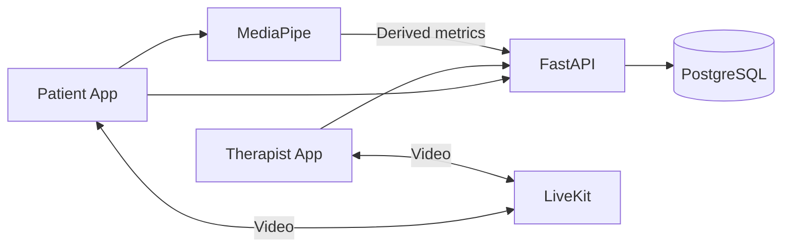

# Stride - Review 1

**Project:** An AI-Assisted Tele-Physiotherapy Platform for Intelligent Rehabilitation  
**Review focus:** Problem feasibility, scope, technology stack, and team roles  
**Team size:** One student developer

## 1. Problem Identification

Remote physiotherapy is commonly delivered using generic video calls and disconnected records. These tools do not help therapists prescribe and monitor exercises, compare progress, or efficiently document a rehabilitation session. Therapists must manually observe movement and count repetitions, while adherence to home exercise is difficult to verify.

### Problem Statement

> Stride proposes a therapist-led tele-physiotherapy platform that combines video consultation, exercise planning, progress tracking, and consent-based camera movement analysis. AI provides approximate movement measurements and repetition counts as decision support; it does not diagnose, prescribe treatment, or replace clinical judgement.

## 2. Requirement Analysis - SRS Summary

### Users

- **Patient:** joins consultations, follows assigned exercises, and views therapist-approved progress.
- **Physiotherapist:** manages patients, plans, consultations, observations, and progress.
- **Administrator:** manages authorised users and roles.

### Functional Requirements

| ID | The system shall... |
|---|---|
| FR-01 | Authenticate users and enforce patient, physiotherapist, and administrator roles. |
| FR-02 | Manage patient profiles, appointments, rehabilitation plans, and session records. |
| FR-03 | Support authorised one-to-one video consultations. |
| FR-04 | Let therapists prescribe exercises with targets and safety instructions. |
| FR-05 | With consent, detect pose landmarks for selected supported exercises. |
| FR-06 | Calculate approximate joint-angle trends and repetition counts with confidence handling. |
| FR-07 | Let therapists review, correct, approve, or reject AI observations. |
| FR-08 | Show exercise adherence and rehabilitation progress over time. |

### Non-Functional Requirements

| Area | Requirement |
|---|---|
| Security and privacy | Server-side role checks, encrypted communication, explicit camera consent, and no raw-video storage by default. |
| Usability and accessibility | Clear language, readable typography, keyboard support, visible focus, strong contrast, and elderly-friendly controls. |
| Performance and reliability | Responsive screens, interactive pose feedback on supported devices, and clear connection/failure states. |
| Maintainability | Modular frontend, API, data, video, and movement-analysis components. |

## 3. Literature Survey

| Evidence | Review 1 conclusion |
|---|---|
| [WHO](https://www.who.int/news-room/fact-sheets/detail/musculoskeletal-conditions) reports approximately 1.71 billion people living with musculoskeletal conditions. | Accessible rehabilitation is a significant healthcare need. |
| [Wicks et al., 2023](https://pmc.ncbi.nlm.nih.gov/articles/PMC10657214/) found physiotherapist-led telerehabilitation effective for several outcomes, with limits to certainty and applicability. | Therapist-supervised remote rehabilitation is worth investigating without claiming universal effectiveness. |
| [Lam et al., 2023](https://pmc.ncbi.nlm.nih.gov/articles/PMC10155325/) reviewed markerless motion capture for rehabilitation measurement. | Camera-based measurement is promising but requires task-specific validation. |
| [Hellsten et al., 2021](https://pmc.ncbi.nlm.nih.gov/articles/PMC8492027/) identified potential in computer-vision rehabilitation while calling for rigorous real-world accuracy testing. | Stride must limit supported exercises, display confidence, and retain therapist oversight. |

**Conclusion:** The literature supports a bounded therapist-led prototype. It does not support using consumer-camera pose estimates as diagnosis or as a replacement for clinical assessment.

## 4. Project Scope

| In Scope - MVP | Out of Scope - MVP |
|---|---|
| Role-based authentication | Diagnosis or injury prediction |
| Patient records and appointments | Autonomous treatment prescription |
| One-to-one video consultation | Replacement of a physiotherapist |
| Therapist-created exercise plans | Support for every condition or exercise |
| Pose overlay for one or two approved exercises | Billing, insurance, EHR, or wearable integration |
| Approximate repetitions and joint-angle trends | Emergency care or production clinical deployment |
| Therapist-reviewed notes, adherence, and progress | Default recording of consultation video |

## 5. Technology Stack

| Layer | Selection | Purpose |
|---|---|---|
| Frontend | Next.js, TypeScript, Tailwind CSS | Responsive patient and therapist web interfaces |
| Backend | FastAPI, Python | Typed APIs and integration with movement-analysis logic |
| Database | PostgreSQL | Structured users, appointments, plans, consent, and records |
| Video | LiveKit | WebRTC consultation rooms and participant management |
| Pose estimation | MediaPipe Pose Landmarker | Live camera pose landmarks on supported exercises |
| Development | Docker Compose, Git, GitHub | Reproducible setup, source control, and review evidence |

Pose analysis is planned on the patient device where practical; derived metrics, rather than raw video, are stored by default.

## 6. UI and Wireframes

The interface will be minimal, professional, reassuring, and accessible to older patients without looking oversimplified. It will use large readable text, labelled controls, clear task hierarchy, restrained healthcare colours, and limited cognitive load.

  

The wireframe set covers:

1. therapist dashboard and review queue;
2. patient-specific rehabilitation plan builder;
3. live video consultation with pose-assisted movement analysis;
4. elderly-friendly patient home dashboard;
5. guided exercise instructions and safety guidance; and
6. accessible patient sign-in.

## 7. Project Plan

| Week | Focus | Review evidence |
|---|---|---|
| 1 | Problem, SRS, literature, scope, wireframes, stack, plan, repository | Review 1 documentation |
| 2 | Database, API, security model, project setup, authentication | ER/UML, database, initial modules |
| 3 | Patients, appointments, dashboards, video integration | Working core flow |
| 4 | Pose overlay, supported exercises, movement metrics, progress | AI-assisted prototype |
| 5 | Functional, security, usability, device, and performance testing | Beta and test report |
| 6 | Deployment, documentation, report, presentation, and demo | Final submission |

## 8. Feasibility

| Area | Assessment |
|---|---|
| Technical | Feasible using established web, video, database, and pose tools. |
| Schedule | Feasible only with strict MVP scope and one or two supported exercises. |
| Economic | Feasible for an academic prototype using open-source tools and limited cloud usage. |
| Operational | Exercise selection, movement rules, safety cues, terminology, and workflow will be reviewed through external physiotherapy consultation. |
| Privacy and safety | Feasible with consent, least-privilege access, minimal data storage, and therapist oversight. |
| Clinical | Clinical feasibility will be explored with professional input, but the prototype will not claim clinical validation. |

**Feasibility conclusion:** Stride is achievable as a six-week academic prototype. A clinically validated, production-ready system requires broader professional evaluation, testing, security work, and regulatory assessment.

## 9. Team Roles

This is an **individual project**. The student developer owns all planning, design, implementation, testing, documentation, deployment, and presentation work.

| Role | Responsibility |
|---|---|
| Student developer - sole project member | Research and requirements; UI/UX; frontend; backend and database; AI integration and evaluation; security; testing; DevOps; documentation; and project management. |
| External physiotherapy consultant - advisory, not a project team member | Helps review clinical terminology, candidate exercises, safe movement instructions, observable exercise criteria, workflow realism, and the limits of camera-based feedback. |
| Faculty guide | Academic review, milestone guidance, and project evaluation. |

## 10. Review 1 Deliverables

| Deliverable | Status |
|---|---|
| Problem Statement and SRS | Completed |
| Literature Survey | Completed for Review 1 |
| Scope, Feasibility, and Technology Stack | Completed |
| Project Plan | Completed |
| Team Roles | Updated for an individual project |
| GitHub Repository | Created and documented |
| UI/Wireframes | Completed and included in Section 6 |

> **Boundary:** Stride is an educational prototype, not a medical device. AI output is assistive and cannot replace assessment or treatment by a qualified healthcare professional.
