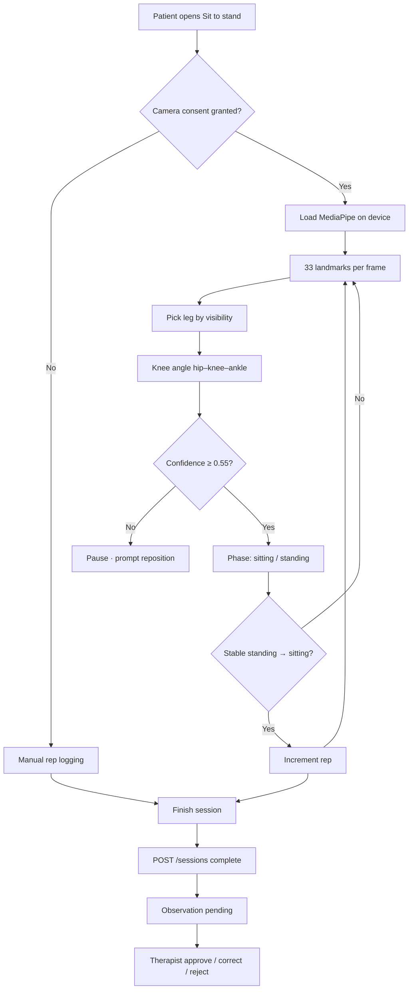

# Stride — Review 4 Documentation

**Project:** An AI-Assisted Tele-Physiotherapy Platform for Intelligent Rehabilitation  
**Week:** 4 — Advanced features  
**Review focus:** AI/ML feature implementation and integration  

| Item | Detail |
|---|---|
| Advanced feature | On-device pose analysis (MediaPipe Pose Landmarker) |
| Exercise | Sit to stand |
| Primary demo | Patient web move screen (`apps/web`) |
| Mobile | Skeleton overlay; manual rep logging (automated counter on web) |

Stride is an educational prototype, not a medical device. Pose output is decision support only; a physiotherapist approves all clinical metrics.

---

## 1. Faculty deliverables (Week 4)

| Deliverable | Section |
|---|---|
| Algorithm / methodology | §2 |
| Flowchart | §2.2 |
| AI/ML model description | §3 |
| Module integration details | §4 |
| Test cases (draft) | §5 |

| Requirement | Evidence |
|---|---|
| Advanced feature implemented | MediaPipe loop + sit-to-stand counter on patient web move screen |
| Integrated with existing system | Consent → sessions API → pending observation → therapist review |
| Functionality | Consent gate, live skeleton, rep/confidence metrics, manual fallback |

---

## 2. Algorithm and methodology

### 2.1 Objective

Count **sit-to-stand repetitions** from live camera input. Suppress unreliable frames. Persist **derived metrics only** (repetitions, confidence, notes)—not raw video.

### 2.2 Processing flowchart



### 2.3 Manual fallback

Without consent or with persistently low confidence, the patient logs repetitions manually. The same sessions API is used; confidence defaults lower when camera assist is off.

---

## 3. AI / ML model

| Attribute | Detail |
|---|---|
| Product | Google MediaPipe Pose Landmarker (Tasks Vision) |
| Package | `@mediapipe/tasks-vision` |
| Variant | `pose_landmarker_lite` (float16) |
| Runtime | Browser WASM; GPU delegate when available, CPU fallback |
| Input | Live webcam frames (~640×480) |
| Output | 33 body landmarks + per-point visibility |
| Training | Pre-trained Google model only; no Stride/patient fine-tuning |
| Use | Home exercise rep logging support; not diagnosis or treatment |

Activity diagram (full guided session): `presentation/public/diagrams/02-activity.png`

---

## 4. Module integration

### 4.1 Data flow

```
apps/web — patient move screen
  POST /consent              (camera_analysis)
  PoseCamera                 MediaPipe loop (client only)
  POST /sessions
  POST /sessions/{id}/complete
       → reported_repetitions, confidence, metric, value, notes
       → movement_observations (review_status = pending)

apps/web — therapist dashboard
  GET /observations          pending queue
  PATCH review               approve | correct | reject
```

### 4.2 Modules changed in Review 4

| Component | Change |
|---|---|
| Patient move UI (web) | Consent toggle, PoseCamera, live reps/confidence/phase |
| Consent (M8) | Gates camera before analysis |
| Sessions (M6) | Accepts pose-derived repetitions and confidence |
| Observations (M7) | Pending metrics from pose-assisted sessions |
| Therapist dashboard | Reviews AI-assisted counts |
| Mobile app | Skeleton overlay; manual rep entry (web holds full sit-to-stand counter) |

### 4.3 Privacy

| Data | Handling |
|---|---|
| Raw video / frames | Not stored; not uploaded during tracking |
| Landmarks | Processed on patient device only |
| Session payload | JSON metrics (reps, confidence, notes) on complete |
| Official progress | Only after therapist approval |

---

## 5. Test cases (draft)

| ID | Scenario | Expected result |
|---|---|---|
| TC-P01 | Open camera before consent | Camera blocked until consent granted |
| TC-P02 | Grant camera_analysis consent | Camera toggle enabled; consent persisted |
| TC-P03 | Complete session without camera | Saved; manual path; confidence ≈ 0.5 |
| TC-P04 | Enable camera, good framing | Skeleton visible; tracking active |
| TC-P05 | Clear sit → stand → sit | Rep counter increments by 1 |
| TC-P06 | Leave frame / cover camera | Reposition prompt; counting pauses |
| TC-P07 | Patient edits rep count before save | API stores corrected value |
| TC-P08 | Complete session with camera | Therapist sees pending observation |
| TC-P09 | Therapist approves observation | Progress published via Review 3 path |
| TC-P10 | Network traffic during tracking | No video upload; JSON only on finish |
| TC-P11 | Exercise without pose recipe (e.g. Heel slides) | Manual log only; no pose panel |
| TC-P12 | Exit via “Not today” | Session not forced to save |

---

## 6. Demo and run

**Password (all accounts):** `StrideClinic1!`

| Role | Email |
|---|---|
| Patient | `riyaz@stride.clinic` |
| Physiotherapist | `therapist@stride.clinic` |

**API**

```bat
cd apps\api
.venv\Scripts\uvicorn app.main:app --reload --host 0.0.0.0 --port 8000
```

**Web**

```bat
cd apps\web
npm run dev
```

**Demo path:** Patient login → Exercises → Sit to stand → consent → enable camera → perform reps → finish → therapist login → review pending observation.

---

## 7. Implementation reference

| Path | Role |
|---|---|
| `apps/web/src/components/PoseCamera.tsx` | Webcam, MediaPipe loop, metrics callback |
| `apps/web/src/lib/pose/landmarks.ts` | Landmark indices, knee angle, visibility |
| `apps/web/src/lib/pose/sitToStand.ts` | Phase state machine, rep counting |
| `apps/web/src/lib/pose/drawSkeleton.ts` | Canvas skeleton overlay |
| `apps/web/src/app/patient/move/[id]/page.tsx` | Consent, camera toggle, session complete |
| `apps/mobile/src/components/PoseSkeletonCamera.tsx` | Mobile skeleton overlay |
| `apps/mobile/src/lib/poseSkeletonHtml.ts` | Inline MediaPipe page for mobile |

**Automated test:** `npm run test:pose` in `apps/web`

---

## 8. Out of scope (Review 4)

- Custom model training on patient video  
- Pose counting for every exercise in the library  
- Production deployment and full test report (Review 5)  
- Medical-device or diagnostic claims  

---

*Review 4 · Stride tele-physiotherapy prototype*
