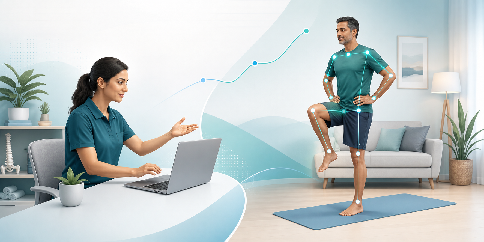
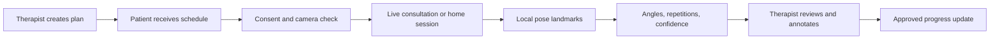
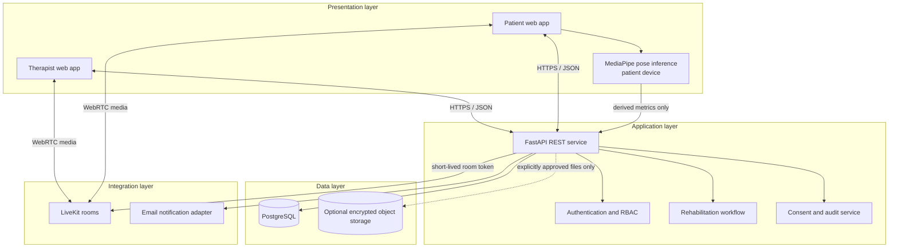
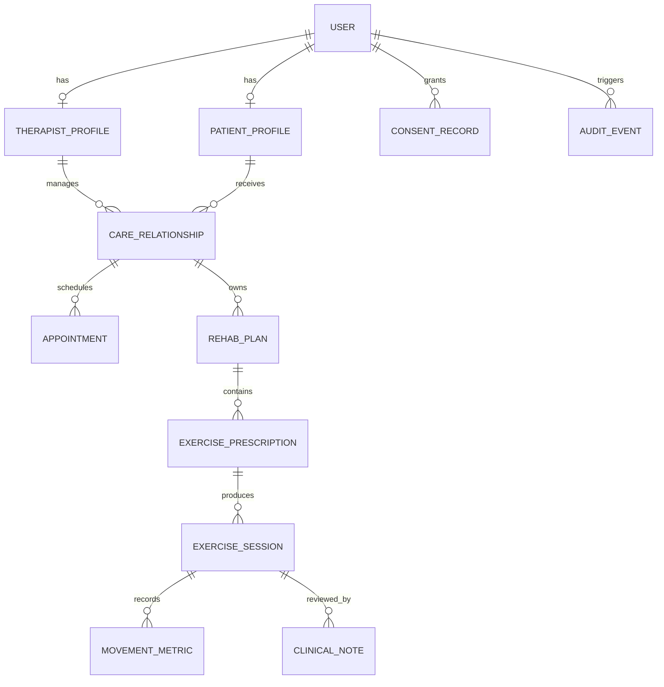

# Stride

<p align="center">
  
</p>

<p align="center">
  <strong>An AI-assisted tele-physiotherapy platform for therapist-led, measurable rehabilitation.</strong>
</p>

> **Faculty reviews:** [Review 1](FIRST_REVIEW.md) · [Review 2](SECOND_REVIEW.md) · [Review 3](THIRD_REVIEW.md)

> **Review 3 status:** working authentication, patient/plan/session CRUD, FastAPI + website + React Native companion. Run the API at `apps/api` and the clinic site at `apps/web`. Dummy wireframes are not the product UI.

> **Review 2 status:** system analysis, refined requirements, UML diagrams, ER model, database design, architecture, UI mockups, and initial module progress are documented in the dedicated Review 2 file.

> **Review 1 status:** problem, scope, feasibility, proposed architecture, requirements, literature basis, technology choices, risks, schedule, and team responsibilities are defined below. Stride is currently a planned academic prototype, not a deployed medical device.

## Local demo database (development)

The clinic demo is seeded through the API models (not hardcoded frontend progress). From `apps/api`:

```bat
python -m app.seed --reset
```

That deletes the local SQLite file, recreates schema, and upserts the demo clinic. Re-run without `--reset` is idempotent and will not create duplicates:

```bat
python -m app.seed
```

**Development/demo credentials only — not for production**

| Role                                          | Email                     | Password         |
| --------------------------------------------- | ------------------------- | ---------------- |
| Administrator                                 | `admin@stride.clinic`     | `StrideClinic1!` |
| Physiotherapist (approved, invite `THERAP01`) | `therapist@stride.clinic` | `StrideClinic1!` |
| Patient (bound to the seeded therapist)       | `riyaz@stride.clinic`     | `StrideClinic1!` |

Override the password locally with `STRIDE_DEMO_PASSWORD`. Do not commit real secrets. Auto-seed on API startup runs only when `STRIDE_ENV` is `dev` **and** the database is SQLite. `--reset` never touches Postgres.

If `apps/api/.env` points at Postgres, the seed command still writes `apps/api/stride.db`. Point the API at that file to use the demo:

```bat
cd apps\api
set STRIDE_DATABASE_URL=sqlite:///./stride.db
python -m app.seed --reset
python -m uvicorn app.main:app --reload --host 127.0.0.1 --port 8000
```

## The one-minute pitch

Stride brings remote consultation, prescribed home exercises, and rehabilitation progress into one therapist-led workflow. During a supported exercise, a standard camera and markerless pose estimation can derive movement landmarks, repetition counts, and approximate joint-angle trends. These signals are presented to the physiotherapist as decision support; the therapist remains responsible for assessment and care decisions.

The project is deliberately narrower than “AI physiotherapy.” The MVP tests whether a small team can build a usable tele-rehabilitation workflow in which AI reduces observation and documentation effort without diagnosing conditions, prescribing treatment, or replacing clinical judgement.

## 1. Problem validation

### Why the problem matters

- Approximately **1.71 billion people** live with musculoskeletal conditions, which are the leading contributor to rehabilitation need worldwide ([WHO](https://www.who.int/news-room/fact-sheets/detail/musculoskeletal-conditions)).
- Remote rehabilitation can improve access and continuity. A systematic review of physiotherapist-led telerehabilitation for older adults found it safe, well adhered to, and effective for several outcomes, but also reported low-certainty evidence for some comparisons and no advantage for pain ([BMC Geriatrics, 2023](https://pmc.ncbi.nlm.nih.gov/articles/PMC10657214/)).
- Evidence should therefore be presented carefully: an overview of reviews found telerehabilitation promising for musculoskeletal pain while highlighting heterogeneity and limitations in the underlying evidence ([Brazilian Journal of Physical Therapy, 2023](https://pmc.ncbi.nlm.nih.gov/articles/PMC10028667/)).

### Observed workflow gap

Generic video calls enable conversation but do not provide a physiotherapy workflow around the call. A therapist still has to coordinate appointments, explain exercises, observe movement through a camera, record findings, and compare progress across sessions using separate tools or manual notes.

Stride addresses five connected gaps:

1. fragmented consultation, exercise, and progress records;
2. limited visibility into home-exercise completion;
3. manual observation and repetition counting during remote sessions;
4. subjective or inconsistently recorded progress between sessions; and
5. documentation overhead after a consultation.

### Problem statement

> How might we help physiotherapists supervise and review remote rehabilitation using accessible camera-based movement signals and a unified clinical workflow, while preserving therapist control, patient privacy, and clear limits on what the AI can claim?

## 2. Proposed solution

Stride is a responsive web platform with two primary experiences.

**For physiotherapists**

- manage patients, appointments, rehabilitation plans, and exercise prescriptions;
- conduct one-to-one video consultations;
- view a live skeleton overlay and movement signals when the patient opts in;
- review completion, range-of-motion trends, repetitions, and session notes; and
- correct or approve system-generated observations before they become part of the record.

**For patients**

- view appointments and join a consultation;
- follow therapist-assigned exercise plans;
- perform supported exercises using a laptop or phone camera;
- receive simple, non-diagnostic form cues; and
- view adherence and therapist-approved progress.

### Product principles

- **Assist, do not diagnose.** AI output is a measurement aid, never a diagnosis or prescription.
- **Therapist in the loop.** Clinically meaningful notes and plan changes require therapist review.
- **Minimum necessary data.** Process pose locally where practical; store derived metrics rather than raw video by default.
- **Explain the signal.** Show which angle, repetition, or confidence value produced a cue.
- **Fail safely.** Low confidence, poor framing, pain, or an unexpected movement pauses feedback and asks the patient to contact the therapist.

## 3. Users, stakeholders, and representative use cases

| Stakeholder           | Need                                                   | Representative use case                                                                                                  |
| --------------------- | ------------------------------------------------------ | ------------------------------------------------------------------------------------------------------------------------ |
| Patient               | Accessible, understandable home rehabilitation         | Join a scheduled session, consent to camera analysis, complete an assigned exercise, and see therapist-approved feedback |
| Physiotherapist       | Reliable supervision and less fragmented documentation | Prescribe an exercise, observe movement signals, annotate the session, and compare progress                              |
| Clinic administrator  | Controlled onboarding and scheduling                   | Create accounts, assign therapists, manage appointments, and view operational status                                     |
| Project/research team | Safe and testable prototype                            | Evaluate usability, latency, pose reliability, and failure conditions on a small approved exercise set                   |

### Core journey



## 4. Scope

### MVP - in scope

- role-based authentication for patient, physiotherapist, and administrator;
- patient profile and rehabilitation record;
- appointment scheduling and reminders;
- one-to-one video consultation;
- therapist-created exercise plan from a small, predefined exercise library;
- consent-based pose landmark overlay for selected exercises;
- rule-based repetition counting and approximate joint-angle calculation;
- session notes, exercise completion, and longitudinal progress view;
- audit events for important record changes; and
- responsive patient and therapist dashboards.

### Explicitly out of scope for the MVP

- diagnosis, injury prediction, autonomous treatment recommendations, or emergency care;
- replacing a licensed physiotherapist;
- validating every physiotherapy exercise or clinical population;
- insurance, billing, pharmacy, or full hospital ERP;
- wearable and IoT integration;
- EHR interoperability and production clinical deployment;
- general-purpose generative-AI clinical advice; and
- recording consultation video by default.

Keeping these items out is a feasibility decision, not a claim that they are unimportant.

## 5. Software requirements summary

### Functional requirements

| ID    | Requirement                               | MVP acceptance criterion                                                                                           |
| ----- | ----------------------------------------- | ------------------------------------------------------------------------------------------------------------------ |
| FR-01 | Authenticate users and enforce roles      | A user can access only routes and records allowed for their role                                                   |
| FR-02 | Manage patients and therapist assignments | An authorised user can create, view, update, and archive a patient relationship                                    |
| FR-03 | Schedule consultations                    | Patient and therapist see the same appointment time and status                                                     |
| FR-04 | Run a video consultation                  | Two authorised participants can join the intended room and exchange audio/video                                    |
| FR-05 | Prescribe exercises                       | Therapist can assign exercise, target repetitions, frequency, and safety note                                      |
| FR-06 | Analyse supported movement                | With consent and sufficient confidence, the app displays landmarks and calculated metrics for an approved exercise |
| FR-07 | Record a session                          | Notes, completion, metrics, and therapist corrections are saved with time and author                               |
| FR-08 | Track progress                            | Patient and therapist can view a chronological trend for a selected exercise or metric                             |
| FR-09 | Audit sensitive actions                   | Login, record access, consent change, and clinical-record update create an audit event                             |

### Non-functional requirements

| Quality         | Initial target for the academic prototype                                                                                                |
| --------------- | ---------------------------------------------------------------------------------------------------------------------------------------- |
| Privacy         | Explicit consent before camera analysis; no raw-video retention by default; documented deletion path                                     |
| Security        | TLS in transit, hashed passwords or external identity provider, least-privilege roles, expiring room tokens, server-side authorization   |
| Performance     | Responsive UI; pose feedback aimed at interactive speed on a supported device; degraded mode when confidence or frame rate is inadequate |
| Reliability     | Clear reconnect states; database migrations and backups; no loss of an already-confirmed clinical note                                   |
| Accessibility   | Keyboard-operable core flows, labelled controls, visible focus, readable contrast, captions/text alternatives where feasible             |
| Maintainability | Typed interfaces, modular services, API documentation, tests for critical authorization and metric calculations                          |
| Compatibility   | Current desktop Chrome/Edge for the first AI prototype; responsive patient screens; broader device support tested later                  |

Targets become release gates only after they are measured on named test devices and networks.

## 6. Proposed architecture

Pose inference is proposed on the patient device for the MVP. This reduces the need to send raw exercise frames to the application backend and separates media transport from stored rehabilitation data.



### Why these technologies

| Area       | Proposed choice                     | Reason for this project                                                                                                                                                                                                                                            |
| ---------- | ----------------------------------- | ------------------------------------------------------------------------------------------------------------------------------------------------------------------------------------------------------------------------------------------------------------------ |
| Web client | Next.js + TypeScript + Tailwind CSS | Next.js provides a structured React framework for interactive full-stack web applications ([official overview](https://nextjs.org/learn/react-foundations/what-is-react-and-nextjs)); TypeScript helps keep role and API contracts explicit                        |
| API        | FastAPI + Python                    | Python keeps pose/analysis integration close to the backend ecosystem; FastAPI uses OpenAPI and provides automatic interactive documentation ([official features](https://fastapi.tiangolo.com/features/))                                                         |
| Data       | PostgreSQL                          | Relational constraints and transactions fit appointments, assignments, consent, and clinical records; PostgreSQL documents strong data-integrity and access-control features ([official overview](https://www.postgresql.org/about/))                              |
| Video      | LiveKit                             | Avoids building a WebRTC media server from scratch; supports rooms and optional E2EE for media/data, which must be explicitly enabled with secure application-managed key distribution ([encryption documentation](https://docs.livekit.io/transport/encryption/)) |
| Pose       | MediaPipe Pose Landmarker           | Supports image, video, and live-stream pose-landmark detection, including asynchronous live input ([Google AI documentation](https://ai.google.dev/edge/api/mediapipe/python/mp/tasks/vision/PoseLandmarker))                                                      |
| Packaging  | Docker Compose for development      | Reproducible local setup for the web app, API, and database                                                                                                                                                                                                        |

Technology versions will be pinned when implementation begins. Cloud vendors are deployment options, not architectural requirements.

### Conceptual data model



## 7. AI-assisted movement analysis

### Planned pipeline

1. Obtain explicit consent and run a framing/lighting check.
2. Detect pose landmarks on-device.
3. Reject frames below a confidence threshold.
4. Smooth landmark coordinates over a short window.
5. Calculate only the joint angles required by the selected exercise.
6. Apply a therapist-approved state machine to count repetitions.
7. Show confidence and a simple cue; persist derived metrics only.
8. Let the therapist accept, correct, or discard the observation.

Markerless motion capture has real rehabilitation potential, but reviews report varied systems, populations, and validation quality ([Sensors, 2023](https://pmc.ncbi.nlm.nih.gov/articles/PMC10155325/)). Research also notes that camera position, occlusion, clothing, lighting, body diversity, and the difference between 2D estimates and clinical-grade biomechanics can affect results ([Sensors, 2021](https://pmc.ncbi.nlm.nih.gov/articles/PMC8492027/)).

### Initial validation plan

- begin with **one or two camera-friendly exercises**, selected with a physiotherapist;
- define correct landmarks, plane, acceptable visibility, and counting states before coding;
- compare system repetition counts with two human-reviewed recordings;
- compare angle estimates against a reference measurement method available to the team;
- test different distances, lighting, clothing, body types, and partial occlusion;
- report mean error, missed/extra repetitions, latency, and failure rate—not only best-case accuracy; and
- do not use an output clinically unless the supervising therapist approves it.

## 8. Privacy, security, ethics, and safety

Health and movement records are personal data. The prototype will use privacy-by-design and will be reviewed against applicable Indian requirements, including the [Digital Personal Data Protection Act, 2023](https://www.indiacode.nic.in/handle/123456789/22037). This README is an engineering plan, not a claim of legal or medical-device compliance.

Minimum controls:

- informed, purpose-specific consent that can be withdrawn;
- least-privilege role checks on every protected server request;
- short-lived, appointment-scoped video room tokens;
- no public patient identifiers in room names, logs, or URLs;
- encryption in transit and protected secrets;
- E2EE evaluated for consultation media, with its key-distribution implications documented;
- retention and deletion rules for each data category;
- audit trail for record access and changes;
- no model training on patient data without separate approval and consent; and
- visible warnings that pain, dizziness, instability, or low-confidence tracking must stop the exercise.

## 9. Competitor and alternative analysis

This comparison is based on publicly described product capabilities, not independent hands-on testing.

| Alternative                                     | Publicly described strength                                      | Gap/opportunity relevant to Stride                                                                                                           |
| ----------------------------------------------- | ---------------------------------------------------------------- | -------------------------------------------------------------------------------------------------------------------------------------------- |
| Generic video meetings                          | Mature real-time communication                                   | No integrated prescription, movement metrics, rehabilitation record, or therapist review loop                                                |
| [Hinge Health](https://www.hingehealth.com/)    | Virtual care, personalised programs, and 3D motion tracking      | Demonstrates that motion-supported digital MSK care is viable; Stride's academic focus is an explainable, clinic-oriented, modular prototype |
| [Sword Health](https://swordhealth.com/)        | Clinician-led digital MSK care with AI and motion technology     | Mature commercial benchmark, not a realistic feature-for-feature MVP target                                                                  |
| [Kaia Health](https://kaiahealth.com/)          | Accessible multimodal digital MSK programs; joined Sword in 2026 | Reinforces the value of home access; Stride concentrates on a live therapist workflow plus transparent pose-derived metrics                  |
| Separate clinic software + video + exercise app | Each tool can be strong in its category                          | Fragmented identity, consent, session context, and progress history                                                                          |

**Proposed differentiator:** a small, therapist-controlled workflow spanning appointment, live consultation, explainable pose signals, exercise adherence, and reviewed progress—not “AI replacing a physiotherapist.”

## 10. Feasibility assessment

| Dimension     | Assessment                                              | Rationale / mitigation                                                                                              |
| ------------- | ------------------------------------------------------- | ------------------------------------------------------------------------------------------------------------------- |
| Technical     | **Feasible with reduced MVP**                           | Use established web, video, database, and pose components; validate only a small exercise set                       |
| Schedule      | **Feasible but high-risk**                              | Six academic weeks is shorter than the abstract's 2–2.5 months; deliver vertical prototypes, not production breadth |
| Operational   | **Feasible with domain input**                          | A physiotherapist must review exercise definitions, cues, failure cases, and evaluation recordings                  |
| Economic      | **Feasible for prototype**                              | Core stack is open source; control cloud video, storage, email, and deployment usage                                |
| Privacy/legal | **Feasible for a non-clinical prototype with controls** | Minimise data, document consent/retention, avoid real patient data until ethics and institutional approval exist    |
| Clinical      | **Not yet validated**                                   | Treat all AI metrics as experimental decision support and publish limitations                                       |

### Highest risks

| Risk                                               | Probability | Impact | Response                                                                     |
| -------------------------------------------------- | ----------: | -----: | ---------------------------------------------------------------------------- |
| Pose estimates fail with poor framing or occlusion |        High |   High | Camera check, confidence gating, supported-device list, limited exercise set |
| Scope exceeds the six-week review plan             |        High |   High | Freeze MVP; defer LLM, wearables, EHR, billing, and broad exercise coverage  |
| Unauthorised health-record access                  |      Medium |   High | Server-side RBAC, ownership checks, audit events, security tests             |
| Video/network instability                          |      Medium |   High | Pre-call device test, reconnection states, session fallback notes            |
| AI output is mistaken for clinical truth           |      Medium |   High | Confidence display, neutral language, therapist approval, safety disclaimer  |
| Lack of domain expert availability                 |      Medium |   High | Schedule exercise-definition and validation sessions in Weeks 1–2            |

## 11. Faculty review plan

The faculty's six-week template is retained. The abstract's longer 2–2.5 month horizon is treated as the time needed for refinement beyond the academic review checkpoints.

| Week                           | Stride activities                                                                                                                     | Deliverable / review evidence                                                    |
| ------------------------------ | ------------------------------------------------------------------------------------------------------------------------------------- | -------------------------------------------------------------------------------- |
| **1 - Project planning**       | Problem validation, literature survey, requirements, scope, architecture, technology choices, wireframes, risk plan, repository setup | **Review 1:** this README, pitch, feasibility, scope, stack, roles, plan         |
| **2 - System design**          | ER diagram, API contract, security model, database migrations, frontend/backend skeleton, initial authentication                      | **Review 2:** architecture quality, ER/UML, database and initial modules         |
| **3 - Core development**       | Roles, patient management, appointments, dashboard, basic LiveKit room, frontend/API integration                                      | **Review 3:** working therapist-to-patient vertical flow and repository activity |
| **4 - Advanced features**      | Pose overlay, one or two exercise state machines, repetitions/angles, confidence handling, progress view                              | **Review 4:** bounded AI feature with validation results and integration         |
| **5 - Testing and deployment** | Authorization, usability, device/network, performance, accessibility, bug fixes, deployment                                           | **Review 5:** beta, test report, end-to-end rehabilitation scenario              |
| **6 - Final submission**       | Documentation, final report, presentation, demo script, limitations and future work                                                   | **Final review:** live demo, source, report, PPT, viva readiness                 |

### Definition of Review 1 done

- [x] Problem and evidence defined
- [x] Users, scope, and exclusions defined
- [x] Functional and non-functional requirements drafted
- [x] Architecture, data model, and technology rationale documented
- [x] AI validation boundary and safety constraints documented
- [x] Feasibility and risks assessed
- [x] Faculty milestones mapped to Stride
- [x] GitHub repository and project README created
- [x] Individual project responsibilities documented
- [x] UI wireframes completed and included
- [x] External physiotherapy consultation included in the validation plan

## 12. Team roles

Stride is an **individual project**. The student developer owns research, requirements, UI/UX, frontend, backend, database, AI integration, evaluation, security, testing, deployment, documentation, and project management.

External physiotherapy consultation supports the review of clinical terminology, exercise selection, safe movement instructions, observable exercise criteria, workflow realism, and the limits of camera-based feedback. This is an advisory contribution and not a development-team role.

## 13. UI wireframes

<p align="center">
  
</p>

The wireframes cover the therapist dashboard, rehabilitation plan builder, live consultation with pose support, patient home dashboard, guided exercise experience, and patient sign-in. The interface uses a minimal professional layout, clear task hierarchy, readable controls, and elderly-friendly patient screens.

## 14. Research questions and success measures

### Research questions

1. Can consumer-device pose landmarks support repeatable tracking for a small set of physiotherapist-approved exercises?
2. Can the combined workflow reduce the steps required to document and review a remote rehabilitation session?
3. Do patients and therapists understand the confidence, limitations, and control model of the AI feedback?

### Prototype success measures

- task completion rate for scheduling, joining, prescribing, and reviewing a session;
- call join success and reconnect behaviour on documented test networks;
- end-to-end pose feedback latency and dropped-frame rate on documented devices;
- repetition-count precision/recall and joint-angle error for each supported exercise;
- System Usability Scale or a small structured usability questionnaire;
- number and severity of authorization/privacy defects found in testing; and
- therapist agreement with, correction of, or rejection of generated observations.

No numerical target will be claimed until the team defines the test protocol and reference measurement.

## 15. Repository plan

```text
stride/
|-- apps/
|   |-- web/                 # Next.js patient and therapist application
|   `-- api/                 # FastAPI service
|-- packages/
|   `-- contracts/           # Shared schemas / generated API types
|-- ai/
|   |-- exercises/           # Approved exercise state machines
|   `-- evaluation/          # Reproducible validation scripts and results
|-- docs/
|   |-- images/
|   |-- research/
|   |-- requirements/
|   `-- wireframes/
|-- infra/                   # Local containers and deployment configuration
`-- tests/                   # Integration and end-to-end tests
```

## References

1. World Health Organization. [Musculoskeletal health](https://www.who.int/news-room/fact-sheets/detail/musculoskeletal-conditions).
2. Wicks, Dennett, and Peiris. [Physiotherapist-led, exercise-based telerehabilitation for older adults](https://pmc.ncbi.nlm.nih.gov/articles/PMC10657214/). _Age and Ageing_, 2023.
3. [Telerehabilitation for musculoskeletal pain - an overview of systematic reviews](https://pmc.ncbi.nlm.nih.gov/articles/PMC10028667/). _Digital Health_, 2023.
4. Lam, Tang, and Fong. [A systematic review of markerless motion capture for clinical measurement in rehabilitation](https://pmc.ncbi.nlm.nih.gov/articles/PMC10155325/). _Journal of NeuroEngineering and Rehabilitation_, 2023.
5. Hellsten et al. [The potential of computer vision-based marker-less human motion analysis for rehabilitation](https://pmc.ncbi.nlm.nih.gov/articles/PMC8492027/). _Rehabilitation Process and Outcome_, 2021.
6. Government of India. [Digital Personal Data Protection Act, 2023](https://www.indiacode.nic.in/handle/123456789/22037).
7. Google AI. [MediaPipe Pose Landmarker API](https://ai.google.dev/edge/api/mediapipe/python/mp/tasks/vision/PoseLandmarker).
8. LiveKit. [End-to-end encryption overview](https://docs.livekit.io/transport/encryption/).

---

**Safety notice:** Stride is an educational software project. It is not a medical device, does not provide a diagnosis, and must not be used as a substitute for assessment or treatment by a qualified healthcare professional.
