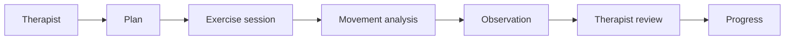
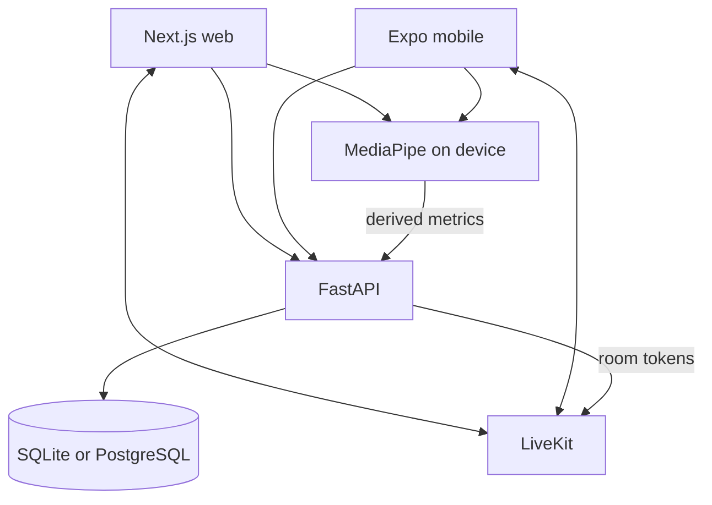

# Stride

Therapist-led tele-physiotherapy for guided rehabilitation plans, on-device movement analysis, progress review, and secure video consultations.

<p align="center">
  
</p>

Stride connects patients and physiotherapists in one care workflow: prescribe exercises, complete home sessions, review movement observations, track approved progress, schedule visits, and join appointment-scoped video calls. Camera-based pose analysis is **decision support only**—it does not diagnose, prescribe treatment, or replace clinical judgement.

> Educational prototype — not a medical device.

---

## Overview

**Problem.** Remote rehab often relies on generic video tools and disconnected notes. Therapists lack a unified place to prescribe home exercises, verify completion, and review movement signals.

**Approach.** A modular clinic stack:

| Client             | Role                                         |
| ------------------ | -------------------------------------------- |
| Web (`web/`)       | Patient, physiotherapist, and admin portals  |
| Mobile (`mobile/`) | Patient companion (plans, sessions, consult) |
| API (`api/`)       | FastAPI care workflow + auth                 |

**Lifecycle**



---

## Why Stride

| Generic alternative      | Stride focus                                         |
| ------------------------ | ---------------------------------------------------- |
| Standalone video meeting | Appointment-bound consult + rehab record             |
| Exercise PDF / tracker   | Prescribed plans, sessions, and review queue         |
| Unreviewed “AI scores”   | Pending → approve / correct / reject before progress |

Differentiation is the **therapist-controlled loop**, not “AI replaces physiotherapy.”

---

## Features

### Patient

- Email registration, OTP verification, invite-code onboarding
- Today’s plan, guided move sessions, progress
- Camera consent + sit-to-stand pose assist (web)
- Appointments and LiveKit consultation join

### Physiotherapist

- Caseload and invite code
- Exercise library and multi-week plan builder
- Observation review queue
- Scheduling, consult join, visit complete/cancel

### Administrator

- Pending therapist approval
- Account status management

---

## Architecture



Full write-up: [docs/PROJECT_DOCUMENTATION.md](docs/PROJECT_DOCUMENTATION.md)

---

## Technology stack

| Layer             | Technology                                             |
| ----------------- | ------------------------------------------------------ |
| Web               | Next.js, TypeScript, React                             |
| Mobile            | Expo / React Native                                    |
| Backend           | FastAPI, SQLAlchemy, Pydantic                          |
| Database          | SQLite (local demo) · PostgreSQL / Supabase (optional) |
| Auth              | JWT, PBKDF2, email OTP                                 |
| Movement analysis | MediaPipe Pose Landmarker                              |
| Video             | LiveKit                                                |
| Exercise content  | Open Rehab Exercises (CC BY 4.0)                       |

---

## Project structure

```text
Stride/
├── README.md
├── api/              # FastAPI backend (+ data/open_rehab catalog)
├── web/              # Next.js clinic web app
├── mobile/           # Expo patient app
└── docs/
    ├── PROJECT_DOCUMENTATION.md
    ├── API.md
    ├── diagrams/
    ├── screenshots/
    ├── wireframes/
    ├── images/
    └── presentation/ # Interactive slide deck
```

---

## Getting started

### Prerequisites

- Python 3.12+
- Node.js 20+ (npm)
- Optional: Android SDK / Expo Dev Client for native mobile pose
- Optional: LiveKit project for video
- Optional: PostgreSQL / Supabase for non-SQLite databases

### 1. API

```bat
cd api
python -m venv .venv
.venv\Scripts\pip install -r requirements.txt
copy .env.example .env
.venv\Scripts\python -m app.seed --reset
.venv\Scripts\uvicorn app.main:app --reload --host 127.0.0.1 --port 8000
```

- OpenAPI: http://127.0.0.1:8000/docs
- Seed creates local SQLite `api/stride.db`
- `--reset` deletes the SQLite file only (never Postgres)
- Auto-seed on startup runs when `STRIDE_ENV=dev` **and** the database is SQLite

Environment template: [`api/.env.example`](api/.env.example)

### 2. Web

```bat
cd web
npm install
npm run dev
```

App: http://localhost:3001

### 3. Mobile (optional)

```bat
cd mobile
npm install
copy .env.example .env
```

Set `EXPO_PUBLIC_API_URL` to your LAN IP (phone and PC on the same network). See [`mobile/.env.example`](mobile/.env.example).

```bat
npm run start
```

For native pose / Dev Client builds, follow the comments in the mobile `.env.example` (`setup:pose-models`, `prebuild`, `build:dev:android`).

### Demo accounts (development only)

Password for all seeded users: `StrideClinic1!`  
Override locally with `STRIDE_DEMO_PASSWORD`. Do not commit real secrets.

| Role                                | Email                     |
| ----------------------------------- | ------------------------- |
| Administrator                       | `admin@stride.clinic`     |
| Physiotherapist (invite `THERAP01`) | `therapist@stride.clinic` |
| Patient                             | `riyaz@stride.clinic`     |

---

## Development

| Task           | Command                                                                         |
| -------------- | ------------------------------------------------------------------------------- |
| API tests      | `cd api` → `.venv\Scripts\python -m pytest`                                     |
| Pose unit test | `cd web` → `npm run test:pose`                                                  |
| Re-seed demo   | `cd api` → `python -m app.seed` (idempotent)                                    |
| LiveKit        | Set `STRIDE_LIVEKIT_URL`, `STRIDE_LIVEKIT_API_KEY`, `STRIDE_LIVEKIT_API_SECRET` |

---

## Documentation

| Document                                               | Description                                                 |
| ------------------------------------------------------ | ----------------------------------------------------------- |
| [Project documentation](docs/PROJECT_DOCUMENTATION.md) | Architecture, workflow, modules, pose pipeline, limitations |
| [API summary](docs/API.md)                             | Endpoint overview (Swagger remains authoritative)           |
| [Diagrams](docs/diagrams/README.md)                    | Use case, activity, class, ER, architecture                 |
| [Screenshots](docs/screenshots/README.md)              | Product UI captures                                         |
| [Presentation](docs/presentation/README.md)            | Interactive review deck                                     |

---

## Security and privacy

- Server-side RBAC and ownership checks
- Explicit camera consent before pose analysis
- Derived metrics stored by default—not raw exercise video
- Short-lived, appointment-scoped video tokens
- Hashed passwords and OTP/reset tokens

Stride does **not** claim HIPAA, medical-device, or clinical validation status. Movement analysis is assistive decision support pending therapist review.

---

## Current status

| Area                                     | Status                             |
| ---------------------------------------- | ---------------------------------- |
| Auth, onboarding, admin approval         | Implemented                        |
| Plans, sessions, observations, progress  | Implemented                        |
| Appointments + LiveKit consult           | Implemented (needs LiveKit config) |
| Sit-to-stand pose (web)                  | Implemented                        |
| Mobile companion                         | Implemented (patient-focused)      |
| Google sign-in                           | Stub (not enabled)                 |
| Production hosting / clinical validation | Not claimed                        |

---

## Limitations

- Automated pose counting is limited to a small exercise set (sit-to-stand on web is the primary counter).
- Landmark quality depends on framing, lighting, clothing, and device.
- Local demo defaults to SQLite; Postgres is optional.
- Email OTP/reset requires SMTP in non-dev setups.

Details: [Known limitations](docs/PROJECT_DOCUMENTATION.md#19-known-limitations).

---

## Roadmap

- Expand physiotherapist-validated pose recipes
- Stronger automated test and evaluation harness
- Production-hardening (Postgres, secrets, HTTPS, monitoring)
- Broader accessibility and device testing

---

## License

No repository-level `LICENSE` file is published yet. Open Rehab exercise content is licensed separately (CC BY 4.0); see `api/data/open_rehab/`.

---

**Safety notice:** Stride is educational software. It must not be used as a substitute for assessment or treatment by a qualified healthcare professional.
