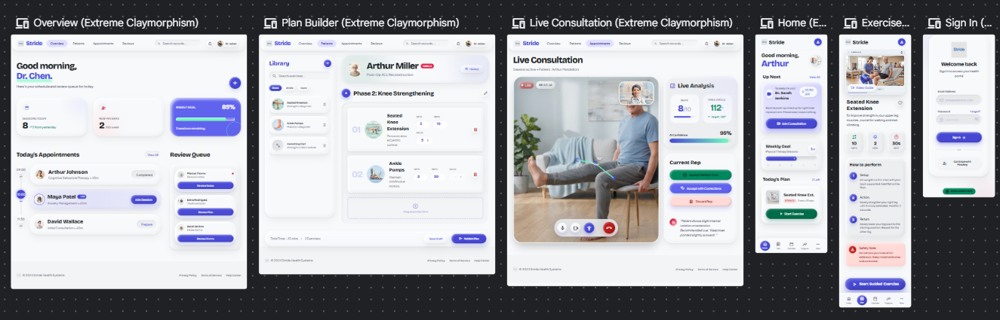

# Stride - Review 2

**Project:** An AI-Assisted Tele-Physiotherapy Platform for Intelligent Rehabilitation

**Review focus:** System analysis, design quality, architecture, database design, UI design, and initial module progress

**Team size:** One student developer

## 1. System Analysis

Stride is a therapist-led rehabilitation platform that connects exercise planning, camera-guided exercise sessions, movement observations, and progress review in one workflow. The current MVP focuses on guided exercise and therapist review rather than video conferencing.

### Users and responsibilities

| User | Main responsibility |
|---|---|
| Patient | Views assigned exercises, grants camera consent, performs guided sessions, and views approved progress. |
| Physiotherapist | Manages patients, creates rehabilitation plans, assigns exercises, and reviews movement observations. |
| Administrator | Manages authorised users, roles, and account status. |

### Main system workflow

1. The physiotherapist creates a rehabilitation plan and assigns an exercise.
2. The patient opens the assigned exercise and reviews its instructions and safety guidance.
3. Camera analysis begins only after consent and a successful framing check.
4. MediaPipe processes body and hand landmarks inside the browser.
5. Stride derives movement metrics such as repetitions, confidence, and approximate joint-angle trends.
6. Only derived session information is prepared for backend storage; raw video is not stored by default.
7. The physiotherapist reviews, approves, corrects, or rejects the observation.
8. Approved information is added to the patient's progress history.

## 2. Software Requirements

### Functional requirements

| ID | The system shall... |
|---|---|
| FR-01 | Authenticate users and enforce patient, physiotherapist, and administrator roles. |
| FR-02 | Manage patient profiles, therapist assignments, and appointments. |
| FR-03 | Allow physiotherapists to create rehabilitation plans and assign exercises with targets and safety notes. |
| FR-04 | Allow patients to view and perform assigned guided exercises. |
| FR-05 | Obtain explicit consent before enabling camera-based movement analysis. |
| FR-06 | Detect supported body and hand landmarks using MediaPipe on the user's device. |
| FR-07 | Produce approximate repetitions, movement metrics, and confidence values for supported exercises. |
| FR-08 | Allow physiotherapists to approve, correct, or reject generated observations. |
| FR-09 | Display adherence and therapist-approved progress over time. |

### Non-functional requirements

| Area | Requirement |
|---|---|
| Privacy | Raw camera frames remain in the browser and are not stored by default. |
| Security | Protected operations require server-side role checks; communication uses HTTPS; passwords are securely hashed. |
| Usability | Screens use clear language, readable type, labelled controls, visible states, and elderly-friendly interaction. |
| Performance | Camera feedback should remain interactive on the supported desktop browser and device. |
| Reliability | Permission, camera, tracking, and API failures must show a clear recovery path without losing confirmed records. |
| Maintainability | Frontend, API, movement analysis, database, and review logic remain separate modules with typed interfaces. |
| Compatibility | The first AI prototype targets current desktop Chrome and Edge with responsive patient screens. |

## 3. Use Case Diagram

The diagram keeps only the major user goals. The patient performs guided exercises and views progress; the physiotherapist manages care and reviews observations; the administrator controls access. MediaPipe participates only as the on-device movement-analysis engine.

## 4. Class Diagram

The domain model separates identity, rehabilitation planning, exercise performance, consent, and clinical review.

- `Patient` and `Physiotherapist` specialise the common `User` class.
- A patient can have multiple `RehabilitationPlan` objects.
- A plan contains one or more `Exercise` definitions.
- Performing an exercise creates an `ExerciseSession`.
- A session produces zero or more `MovementObservation` objects.
- A physiotherapist reviews observations before they become approved progress.
- `ConsentRecord` represents the patient's camera-analysis decision.

## 5. Activity Diagram

The activity begins when a patient selects an assigned exercise. Camera analysis is optional and consent-controlled. When tracking confidence is inadequate, the system pauses analysis and guides the patient to reposition. Reliable landmarks are converted into movement metrics and live feedback. When the session finishes, a derived summary is created and submitted for physiotherapist review.

## 6. ER Diagram

The database model separates reusable exercise definitions from prescriptions and performed sessions. This avoids duplicating exercise instructions for every patient while allowing each rehabilitation plan to define its own targets.

## 7. Database Design

### Core tables

| Table | Purpose | Important fields |
|---|---|---|
| `users` | Stores authenticated users and roles. | `id`, `email`, `full_name`, `password_hash`, `role`, `status` |
| `appointments` | Stores scheduled patient-therapist sessions. | `id`, `patient_id`, `therapist_id`, `scheduled_at`, `status` |
| `rehabilitation_plans` | Stores patient-specific plans created by a physiotherapist. | `id`, `patient_id`, `therapist_id`, `title`, `start_date`, `status` |
| `exercises` | Stores reusable exercise instructions and safety guidance. | `id`, `name`, `instructions`, `safety_notes` |
| `plan_exercises` | Connects a plan to an exercise with patient-specific targets. | `id`, `plan_id`, `exercise_id`, `target_sets`, `target_repetitions` |
| `exercise_sessions` | Stores one performance of an assigned exercise. | `id`, `plan_exercise_id`, `started_at`, `ended_at`, `status` |
| `movement_observations` | Stores derived metrics and therapist review state. | `id`, `session_id`, `metric`, `value`, `confidence`, `review_status` |
| `consent_records` | Stores consent status for camera-analysis purposes. | `id`, `patient_id`, `purpose`, `status`, `granted_at`, `revoked_at` |

### Database rules

- PostgreSQL is selected for relational integrity and structured clinical-workflow data.
- UUIDs are used as primary keys to avoid predictable public identifiers.
- Foreign keys prevent plans, sessions, and observations from becoming disconnected from their owners.
- User email is unique, and roles and statuses use constrained values.
- `plan_exercises` resolves the many-to-many relationship between plans and reusable exercises.
- The model follows third normal form: user, exercise, plan, session, consent, and observation data are stored separately.
- Raw camera video is not part of the schema. Only derived summaries and review decisions are stored.
- Creation and update timestamps will support traceability and auditing.

## 8. System Architecture

### Layer responsibilities

| Layer | Technology | Responsibility |
|---|---|---|
| Presentation | Next.js and TypeScript | Role-aware dashboards, exercise instructions, camera controls, live overlay, and review screens. |
| Movement analysis | MediaPipe Pose and Hand Landmarker | Local landmark detection for supported exercises. |
| Application | FastAPI and Python | Authentication, authorisation, patient management, rehabilitation workflow, session summaries, and review actions. |
| Data | PostgreSQL | Users, plans, exercises, sessions, observations, consent, and progress records. |

### Architecture decisions

- MediaPipe runs inside the browser so exercise frames do not need to be transmitted to the backend.
- The frontend sends only required derived metrics and session information through HTTPS APIs.
- FastAPI owns authorisation and business rules; the browser cannot approve its own protected changes.
- The physiotherapist remains responsible for accepting or correcting movement observations.
- Separate modules allow the pose engine, exercise rules, and user interface to evolve independently.

## 9. UI Design and Mockups

  

The UI direction is minimal, professional, and accessible without becoming visually empty. The wireframes cover the physiotherapist dashboard, plan builder, movement-analysis view, patient home, exercise guidance, and sign-in.

### UI principles

- Large readable text and clear contrast for elderly users.
- One primary action per screen with labelled controls rather than icon-only actions.
- Calm healthcare colours and limited visual noise.
- Visible camera, tracking, permission, loading, and error states.
- Exercise instructions and safety guidance shown before starting analysis.
- AI observations clearly separated from physiotherapist-approved information.
- Responsive behaviour for desktop and patient-facing mobile screens.

## 10. Initial Module Development

| Module | Current Review 2 status | Evidence |
|---|---|---|
| Responsive therapist dashboard | Prototype implemented | Dashboard, appointments, patient activity, and review queue UI |
| Browser camera module | Prototype implemented | Camera start, stop, retry, framing guidance, and permission handling |
| Pose and hand tracking | Prototype implemented | MediaPipe Pose plus 21-landmark Hand Landmarker overlay |
| Local model assets | Implemented | Pose, hand, and WebAssembly assets served with the frontend |
| Tracking feedback | Prototype implemented | Skeleton toggle, pose-detected state, confidence handling, and FPS display |
| Authentication and RBAC | Designed | Roles, access boundaries, and protected-service responsibilities defined |
| FastAPI backend modules | Designed for initial integration | API boundaries for users, plans, sessions, review, and consent defined |
| PostgreSQL database | Schema designed | ER model, keys, constraints, and normalised table design completed |
| Persistent therapist review workflow | UI and data flow designed | Observation status and approve/correct flow defined; API persistence remains to be integrated |

### Next implementation steps

1. Create database migrations for the approved schema.
2. Implement authentication and server-side role checks.
3. Build patient, plan, exercise, and session API endpoints.
4. Connect the Next.js interface to FastAPI.
5. Store derived session summaries and therapist review decisions.
6. Add validation and authorisation tests for protected operations.

## 11. Requirement Traceability

| Requirement group | Design evidence |
|---|---|
| Authentication and roles | Use case diagram, `User` hierarchy, application architecture |
| Patient and plan management | Use case diagram, class diagram, ER diagram |
| Guided exercise | Activity diagram, camera module, UI wireframes |
| Movement analysis | Activity diagram, MediaPipe browser module, architecture diagram |
| Therapist review | Class diagram, observation table, review module |
| Consent and privacy | Activity diagram, consent entity, browser privacy boundary |
| Progress tracking | Session and observation entities, approved-progress use case |

## 12. Review 2 Deliverables

| Deliverable | Status |
|---|---|
| System analysis | Completed |
| Functional and non-functional requirements | Completed and refined for the current MVP |
| Use case diagram | Completed |
| Class diagram | Completed |
| Activity diagram | Completed |
| ER diagram | Completed |
| Database design | Completed at design level |
| System architecture | Completed |
| UI mockups | Completed |
| Initial frontend and movement-analysis modules | Prototype implemented |
| Backend and persistent database integration | Designed; implementation in progress |

> **Boundary:** Stride is an educational prototype, not a medical device. Camera-derived metrics are approximate decision-support signals and cannot replace assessment or treatment by a qualified physiotherapist.
