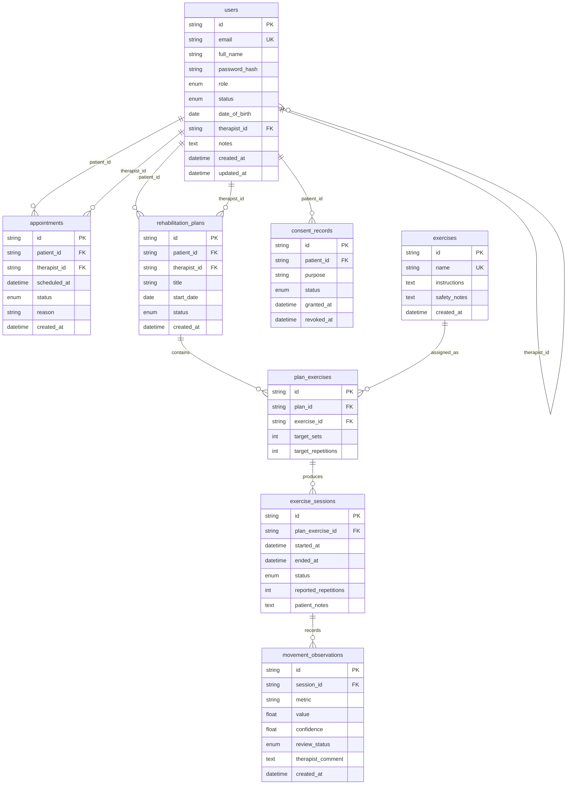
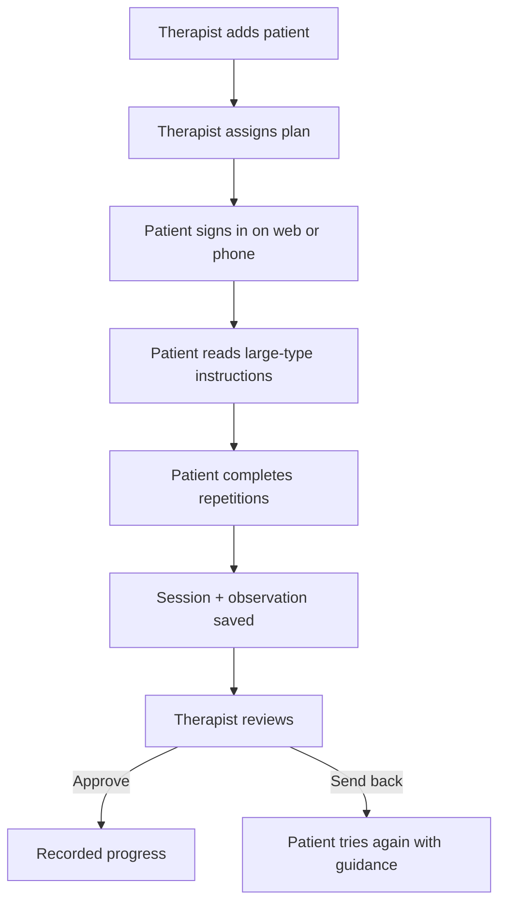

# Stride — Review 3

**Project:** An AI-Assisted Tele-Physiotherapy Platform for Intelligent Rehabilitation  
**Review focus:** Working modules, code quality, GitHub activity, API and database evidence  
**Clients:** Clinic website (Next.js) and patient phone app (React Native / Expo)  
**API:** FastAPI · SQLite for local demo (PostgreSQL-ready schema)

Stride is still an educational prototype, not a medical device. Camera pose analysis remains Week 4. Review 3 proves the **care workflow**: sign-in, roles, patient records, plans, sessions, and therapist review.

## 1. What faculty will see

| Check | Evidence |
|---|---|
| Frontend + backend | `apps/web` talks to `apps/api`. Patient, therapist, and admin screens are live. |
| Authentication | JWT login at `POST /auth/token`. Roles: patient, physiotherapist, administrator. |
| CRUD | Patients, exercises, plans, appointments, sessions, observations, consent, admin user status. |
| Module integration | One API. Website and React Native app use the same endpoints. |
| Code quality | Typed Python models, role checks on the server, focused UI modules, API tests. |
| GitHub activity | Implementation lives under `apps/` on branch `feature/review-3-core`. |
| Module description | This file, section 3. |
| API documentation | Swagger at `/docs` and `docs/review3/API.md`. |
| Screenshots | `docs/review3/screenshots/` (capture after `npm run dev`). |
| Database schema | Section 5. Tables created on API startup from `apps/api/app/models.py`. |
| Workflow diagram | Section 6. |

## 2. Demo accounts

Password for every demo user: `StrideClinic1!`

| Role | Email | What to show |
|---|---|---|
| Patient | `kamala@stride.clinic` | Large-type home plan, start a movement, save repetitions |
| Physiotherapist | `therapist@stride.clinic` | Patient list, add patient, assign plan, approve observation |
| Administrator | `admin@stride.clinic` | Activate / deactivate accounts |

## 3. Module description

| Module | What it does | Who uses it |
|---|---|---|
| Identity | Email + password, hashed with PBKDF2, JWT, account status | All roles |
| Patient records | Create, read, update, archive patients assigned to a therapist | Physiotherapist |
| Exercise library | Reusable instructions and safety notes | Therapist writes; patient reads |
| Rehabilitation plans | Plan + assigned exercises with sets/reps | Therapist creates; patient performs |
| Appointments | Upcoming clinic visits | Therapist schedules; both view |
| Exercise sessions | Start and complete a home session | Patient |
| Movement observations | Derived metrics waiting for clinical review | Therapist approves or sends back |
| Consent | Camera-analysis purpose flag (pose comes in Week 4) | Patient |
| Administration | Account status | Administrator |
| Patient phone app | Same patient flow without a laptop | Patient / family helper |

## 4. How to run (Windows)

Terminal 1 — API:

```bat
cd apps\api
python -m venv .venv
.venv\Scripts\pip install -r requirements.txt
.venv\Scripts\python -m pytest
.venv\Scripts\uvicorn app.main:app --reload --host 127.0.0.1 --port 8000
```

Open `http://127.0.0.1:8000/docs` for interactive API documentation.

Terminal 2 — website:

```bat
cd apps\web
npm install
npm run dev
```

Open `http://localhost:3000`.

Terminal 3 — phone app (optional for the viva):

```bat
cd apps\mobile
npm install
npx expo start
```

On Android emulator, set `EXPO_PUBLIC_API_URL=http://10.0.2.2:8000`. On a physical phone, use your PC’s LAN IP and keep the phone on the same Wi-Fi.

## 5. Database schema

Implemented in `apps/api/app/models.py`. SQLite file `apps/api/stride.db` is created on API startup (`Base.metadata.create_all`). Column design matches Review 2. PostgreSQL remains the production target.

Primary keys are UUID strings (`CHAR(36)`). Timestamps use timezone-aware datetimes.

### 5.1 Entity-relationship diagram



### 5.2 Tables and columns

#### `users`

Accounts for patient, physiotherapist, and administrator. A patient may point at an assigned therapist via `therapist_id` (self-FK on `users`).

| Column | Type | Constraints |
|---|---|---|
| `id` | `String(36)` | PK, UUID |
| `email` | `String(255)` | unique, indexed |
| `full_name` | `String(255)` | required |
| `password_hash` | `String(255)` | PBKDF2 hash |
| `role` | enum `UserRole` | `patient` · `physiotherapist` · `administrator` |
| `status` | enum `AccountStatus` | `active` · `inactive` (default `active`) |
| `date_of_birth` | `Date` | nullable (patients) |
| `therapist_id` | `String(36)` | FK → `users.id`, nullable |
| `notes` | `Text` | nullable |
| `created_at` | `DateTime(tz)` | server default now |
| `updated_at` | `DateTime(tz)` | server default now, on update |

#### `appointments`

Scheduled visits shared by patient and therapist.

| Column | Type | Constraints |
|---|---|---|
| `id` | `String(36)` | PK |
| `patient_id` | `String(36)` | FK → `users.id` |
| `therapist_id` | `String(36)` | FK → `users.id` |
| `scheduled_at` | `DateTime(tz)` | required |
| `status` | enum `AppointmentStatus` | `scheduled` · `completed` · `cancelled` |
| `reason` | `String(500)` | nullable |
| `created_at` | `DateTime(tz)` | server default now |

#### `exercises`

Reusable library of movements with elderly-first instructions.

| Column | Type | Constraints |
|---|---|---|
| `id` | `String(36)` | PK |
| `name` | `String(255)` | unique |
| `instructions` | `Text` | required |
| `safety_notes` | `Text` | required |
| `created_at` | `DateTime(tz)` | server default now |

#### `rehabilitation_plans`

One active plan per patient in the demo seed; therapists can create more.

| Column | Type | Constraints |
|---|---|---|
| `id` | `String(36)` | PK |
| `patient_id` | `String(36)` | FK → `users.id` |
| `therapist_id` | `String(36)` | FK → `users.id` |
| `title` | `String(255)` | required |
| `start_date` | `Date` | required |
| `status` | enum `PlanStatus` | `draft` · `active` · `completed` |
| `created_at` | `DateTime(tz)` | server default now |

#### `plan_exercises`

Join of a plan to a library exercise with targets. Unique on `(plan_id, exercise_id)`.

| Column | Type | Constraints |
|---|---|---|
| `id` | `String(36)` | PK |
| `plan_id` | `String(36)` | FK → `rehabilitation_plans.id` |
| `exercise_id` | `String(36)` | FK → `exercises.id` |
| `target_sets` | `Integer` | required |
| `target_repetitions` | `Integer` | required |

#### `exercise_sessions`

One home performance of an assigned plan exercise.

| Column | Type | Constraints |
|---|---|---|
| `id` | `String(36)` | PK |
| `plan_exercise_id` | `String(36)` | FK → `plan_exercises.id` |
| `started_at` | `DateTime(tz)` | server default now |
| `ended_at` | `DateTime(tz)` | nullable |
| `status` | enum `SessionStatus` | `in_progress` · `completed` · `abandoned` |
| `reported_repetitions` | `Integer` | nullable |
| `patient_notes` | `Text` | nullable |

#### `movement_observations`

Derived metrics from a session, held for therapist review.

| Column | Type | Constraints |
|---|---|---|
| `id` | `String(36)` | PK |
| `session_id` | `String(36)` | FK → `exercise_sessions.id` |
| `metric` | `String(100)` | e.g. `repetitions` |
| `value` | `Float` | required |
| `confidence` | `Float` | 0–1 range in the demo |
| `review_status` | enum `ReviewStatus` | `pending` · `approved` · `corrected` · `rejected` |
| `therapist_comment` | `Text` | nullable |
| `created_at` | `DateTime(tz)` | server default now |

#### `consent_records`

Purpose-specific camera-analysis consent (pose analysis is Week 4).

| Column | Type | Constraints |
|---|---|---|
| `id` | `String(36)` | PK |
| `patient_id` | `String(36)` | FK → `users.id` |
| `purpose` | `String(100)` | e.g. `camera_analysis` |
| `status` | enum `ConsentStatus` | `granted` · `revoked` |
| `granted_at` | `DateTime(tz)` | server default now |
| `revoked_at` | `DateTime(tz)` | nullable |

### 5.3 Enumerations

| Enum | Values |
|---|---|
| `UserRole` | `patient`, `physiotherapist`, `administrator` |
| `AccountStatus` | `active`, `inactive` |
| `AppointmentStatus` | `scheduled`, `completed`, `cancelled` |
| `PlanStatus` | `draft`, `active`, `completed` |
| `SessionStatus` | `in_progress`, `completed`, `abandoned` |
| `ReviewStatus` | `pending`, `approved`, `corrected`, `rejected` |
| `ConsentStatus` | `granted`, `revoked` |

## 6. Workflow



## 7. Design notes (elderly-first)

The visual language keeps Review 1’s paper, ink, and lime — not a generic purple dashboard.

- Body text 20px+, headings in Georgia
- Primary buttons at least 60px tall, full width on phones
- One job per patient screen
- Stop-if-pain copy in coral, never colour-only status
- Bottom bar: Home / Plan / Help
- Family helper can tap the same buttons

The dummy wireframe image is not the product UI.

## 8. Market path (not in this review’s grade)

The same API will serve clinic desktops and the React Native app. Pose stays on-device later. A practising physiotherapist (project originator) reviews exercise wording and safety. Do not claim medical-device status.

## 9. Honest boundary for Review 3

Working: auth, CRUD, integration, GitHub-ready modules, OpenAPI, schema, patient/therapist/admin UI, RN companion.

Not this week: MediaPipe overlay, LiveKit video, production Postgres hosting, app-store release.
