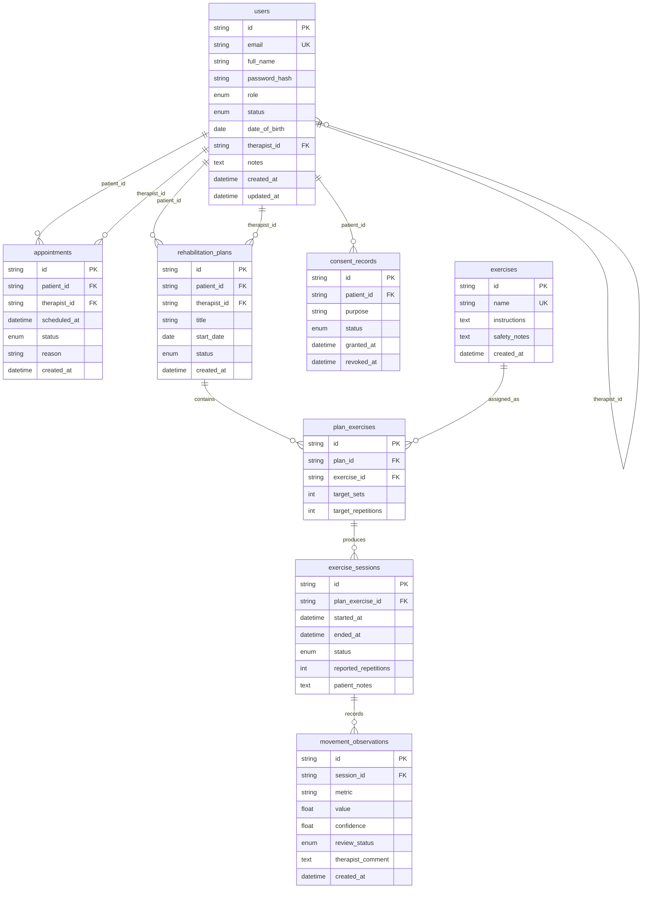
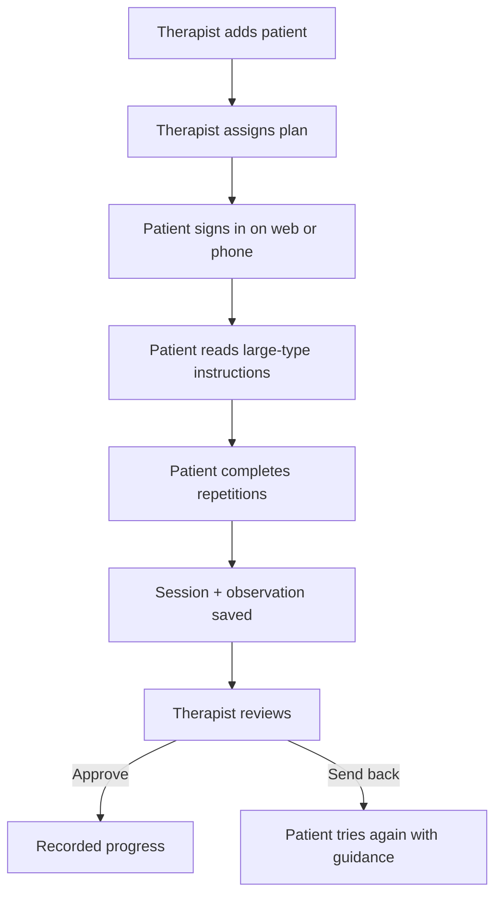

# Stride — Review 3

**Project:** An AI-Assisted Tele-Physiotherapy Platform for Intelligent Rehabilitation  
**Review focus:** Working modules, code quality, GitHub activity, API and database evidence  
**Clients:** Clinic website (Next.js) and patient phone app (React Native / Expo)  
**API:** FastAPI · SQLite for local demo (PostgreSQL-ready schema)

Stride is still an educational prototype, not a medical device. Camera pose analysis remains Week 4. Review 3 proves the **care workflow**: sign-in, roles, patient records, plans, sessions, and therapist review.

## 1. What faculty will see

| Check | Evidence |
|---|---|
| Frontend + backend | `apps/web` talks to `apps/api`. Patient, therapist, and admin screens are live. |
| Authentication | JWT login at `POST /auth/token`. Roles: patient, physiotherapist, administrator. |
| CRUD | Patients, exercises, plans, appointments, sessions, observations, consent, admin user status. |
| Module integration | One API. Website and React Native app use the same endpoints. |
| Code quality | Typed Python models, role checks on the server, focused UI modules, API tests. |
| GitHub activity | Implementation lives under `apps/` on branch `feature/review-3-core`. |
| Module description | This file, §3 — module specifications (abstraction + interface behaviour). |
| API documentation | Swagger at `/docs` and `docs/review3/API.md`. |
| Screenshots | `docs/review3/screenshots/` (capture after `npm run dev`). |
| Database schema | This file, §5 (ER diagram, relationships, columns, enums, exclusions). |
| Workflow diagram | Section 6. |

## 2. Demo accounts

Password for every demo user: `StrideClinic1!`

| Role | Email | What to show |
|---|---|---|
| Patient | `kamala@stride.clinic` | Large-type home plan, start a movement, save repetitions |
| Physiotherapist | `therapist@stride.clinic` | Patient list, add patient, assign plan, approve observation |
| Administrator | `admin@stride.clinic` | Activate / deactivate accounts |

## 3. Module specifications

In Stride, a **module** is a loosely coupled unit of the care system with a clear **external interface**. Callers use only that interface; internal algorithms and storage layout stay hidden (**functional abstraction** and **data abstraction**).

Each specification below aims to be:

| Property | Meaning for Stride |
|---|---|
| **Complete** | Enough behaviour that another client (web or phone) can integrate without guessing |
| **Unambiguous** | One clear interpretation of inputs, outputs, and roles |
| **Understandable** | Stated in care-domain language, not framework jargon |
| **Implementation-independent** | Describes *what* the module must do, not *how* it is coded |

Implementation evidence for Review 3 (routers, screens, tables) is summarised in §3.3 after the specifications.

### 3.1 Abstraction used in Stride

| Abstraction | In this project |
|---|---|
| **Data abstraction** | Domain entities (`User`, `Plan`, `Session`, …) are exposed by allowed operations and attributes. Callers do not depend on SQLite layout, password-hash format, or JWT encoding internals. |
| **Functional abstraction** | Modules such as “sign in”, “complete session”, or “review observation” are used through a known calling convention (HTTP/API or UI action). Callers need not know the algorithm inside. |

### 3.2 Module catalogue (specifications)

#### M1 — Identity & access

| | |
|---|---|
| **Purpose** | Authenticate clinic users and expose the signed-in identity with role and account status. |
| **Users** | Patient, physiotherapist, administrator |
| **Interface (what callers may do)** | Submit credentials → receive an access token and profile; read current identity; reject inactive accounts. |
| **Inputs** | Email, password |
| **Outputs** | Authenticated session (token + role + display name), or a clear authentication failure |
| **Preconditions** | Account exists and is active |
| **Postconditions** | Only authorised roles reach protected modules; password material is never returned |
| **Does not specify** | Hash algorithm, token library, or storage engine |

#### M2 — Patient records

| | |
|---|---|
| **Purpose** | Maintain patient profiles assigned to a physiotherapist. |
| **Users** | Physiotherapist (write); administrator (oversight); patient (read own care context via other modules) |
| **Interface** | Create, read, update, and archive patient records; list patients for the signed-in therapist. |
| **Inputs** | Patient identity fields (name, email, date of birth, notes); therapist association |
| **Outputs** | Patient record(s) consistent with the calling therapist’s caseload |
| **Preconditions** | Caller is an authorised clinician; email uniqueness holds for new accounts |
| **Postconditions** | Patient remains linked to exactly one assigned therapist in the demo model; archive removes from active caseload without orphaning historical plans/sessions |
| **Does not specify** | UI layout or database table names |

#### M3 — Exercise library

| | |
|---|---|
| **Purpose** | Provide reusable exercise definitions with instructions and safety guidance. |
| **Users** | Therapist / admin maintain; patient reads assigned items via plans |
| **Interface** | List exercises; create or update library entries. |
| **Inputs** | Name, instructions, safety notes |
| **Outputs** | Exercise definitions suitable for prescription into plans |
| **Preconditions** | Exercise names are unique |
| **Postconditions** | Updating a library entry does not silently invent plan targets; plans reference exercises by identity |
| **Does not specify** | MediaPipe pose rules or video content |

#### M4 — Rehabilitation plans

| | |
|---|---|
| **Purpose** | Prescribe a patient-specific plan composed of library exercises with targets. |
| **Users** | Physiotherapist creates; patient views and performs |
| **Interface** | Create a plan for a patient; attach exercises with `target_sets` and `target_repetitions`; read plan detail. |
| **Inputs** | Patient, title, start date, status; list of exercise assignments with targets |
| **Outputs** | A plan the patient can execute as sessions |
| **Preconditions** | Patient and exercises exist; caller is the responsible therapist (or admin) |
| **Postconditions** | Plan items are uniquely identified per `(plan, exercise)`; patient sees only their own plans |
| **Does not specify** | Scheduling UI or notification delivery |

#### M5 — Appointments

| | |
|---|---|
| **Purpose** | Schedule and list clinic visits between patient and therapist. |
| **Users** | Therapist schedules; patient and therapist view |
| **Interface** | Create appointment; list appointments visible to the caller. |
| **Inputs** | Patient, therapist, scheduled time, optional reason, status |
| **Outputs** | Appointment records with status (`scheduled` / `completed` / `cancelled`) |
| **Preconditions** | Both parties exist and are active |
| **Postconditions** | Each appointment retains both patient and therapist associations |
| **Does not specify** | Calendar sync or SMS reminders |

#### M6 — Exercise sessions

| | |
|---|---|
| **Purpose** | Record one home performance of an assigned plan exercise. |
| **Users** | Patient |
| **Interface** | Start a session for a plan exercise; complete it with reported repetitions and optional notes. |
| **Inputs** | Plan-exercise identity; reported repetitions; notes |
| **Outputs** | Session in `in_progress` then `completed` (or abandoned); ready for observation creation |
| **Preconditions** | Plan exercise belongs to the signed-in patient |
| **Postconditions** | Completed sessions have an end time and reported count; incomplete sessions remain distinguishable |
| **Does not specify** | Camera tracking or automatic rep counting (Week 4) |

#### M7 — Movement observations & clinical review

| | |
|---|---|
| **Purpose** | Store derived session metrics and allow therapist review decisions. |
| **Users** | System/patient produce; physiotherapist reviews; patient sees approved progress |
| **Interface** | List observations (pending queue for therapist; approved for patient); update review status with optional comment. |
| **Inputs** | Session link, metric name, value, confidence; review decision |
| **Outputs** | Observation with `pending` / `approved` / `corrected` / `rejected` |
| **Preconditions** | Session exists; reviewer is an authorised clinician |
| **Postconditions** | Only reviewed outcomes become trusted progress for the patient view |
| **Does not specify** | How metrics were derived (manual entry in Review 3; pose later) |

#### M8 — Consent

| | |
|---|---|
| **Purpose** | Record purpose-scoped consent for camera-based analysis. |
| **Users** | Patient |
| **Interface** | Grant or revoke consent for a named purpose (e.g. `camera_analysis`); read current status. |
| **Inputs** | Purpose, grant/revoke action |
| **Outputs** | Consent record with timestamps |
| **Preconditions** | Caller is the patient owning the record |
| **Postconditions** | Camera analysis features must treat revoked consent as denial (enforced when pose ships in Week 4) |
| **Does not specify** | Legal policy text or storage of raw video |

#### M9 — Administration

| | |
|---|---|
| **Purpose** | Control clinic account activation without changing clinical data. |
| **Users** | Administrator |
| **Interface** | List users; set account status to active or inactive. |
| **Inputs** | User identity, target status |
| **Outputs** | Updated account status |
| **Preconditions** | Caller is an administrator |
| **Postconditions** | Inactive accounts cannot obtain new authenticated sessions |
| **Does not specify** | Billing, audit log UI, or password reset flows |

#### M10 — Video consult (signaling)

| | |
|---|---|
| **Purpose** | Allow patient and therapist to join a real-time video consult for the demo. |
| **Users** | Patient (phone/web), physiotherapist (web) |
| **Interface** | Join a named room; exchange connection signaling so peers can see/hear each other; leave the room. |
| **Inputs** | Room identity, display name, signaling messages |
| **Outputs** | Peer connection readiness; live media path between participants |
| **Preconditions** | Both peers can reach the signaling service over a secure context when required by the client |
| **Postconditions** | Leaving removes the peer from the room; media is not persisted by Stride |
| **Does not specify** | Codec choice, TURN vendor, or recording |

### 3.3 Review 3 evidence map (implementation)

Faculty checklist: specifications above are **implemented** and integrated. Mapping for viva only — not part of the abstract specification.

| Module | Primary API surface | Primary clients | Persisted data |
|---|---|---|---|
| M1 Identity | `/auth/token`, `/auth/me` | Web login, mobile login | `users` |
| M2 Patient records | `/patients` | Therapist portal | `users` (patient role) |
| M3 Exercise library | `/exercises` | Therapist + patient plan views | `exercises` |
| M4 Plans | `/plans` | Therapist create; patient home/plan | `rehabilitation_plans`, `plan_exercises` |
| M5 Appointments | `/appointments` | Web + mobile appointments | `appointments` |
| M6 Sessions | `/sessions` | Patient move flow (web + mobile) | `exercise_sessions` |
| M7 Observations | `/observations` | Therapist review; patient progress | `movement_observations` |
| M8 Consent | `/consent` | Patient help / future camera gate | `consent_records` |
| M9 Administration | `/admin/users` | Admin dashboard | `users.status` |
| M10 Video consult | `/video/room`, `/video/ws` | Web `VideoRoom`, mobile `ConsultScreen` | *(none — ephemeral signaling)* |

## 4. How to run (Windows)

Terminal 1 — API:

```bat
cd apps\api
python -m venv .venv
.venv\Scripts\pip install -r requirements.txt
.venv\Scripts\python -m pytest
.venv\Scripts\uvicorn app.main:app --reload --host 127.0.0.1 --port 8000
```

Open `http://127.0.0.1:8000/docs` for interactive API documentation.

Terminal 2 — website:

```bat
cd apps\web
npm install
npm run dev
```

Open `http://localhost:3000`.

Terminal 3 — phone app (optional for the viva):

```bat
cd apps\mobile
npm install
npx expo start
```

On Android emulator, set `EXPO_PUBLIC_API_URL=http://10.0.2.2:8000`. On a physical phone, use your PC’s LAN IP and keep the phone on the same Wi-Fi.

## 5. Database schema

Implemented in `apps/api/app/models.py`. On API startup, SQLAlchemy runs `Base.metadata.create_all` and creates SQLite file `apps/api/stride.db`. Column design matches Review 2; PostgreSQL remains the production target (`STRIDE_DATABASE_URL`).

**Conventions**

| Rule | Choice |
|---|---|
| Primary keys | UUID strings (`String(36)` / `CHAR(36)`) |
| Timestamps | Timezone-aware `DateTime` |
| Roles / statuses | SQLAlchemy `Enum` columns (constrained values) |
| Integrity | Foreign keys on every relationship |
| Normalisation | 3NF — user, exercise library, plan, session, observation, and consent are separate |
| Not stored | Raw camera video, WebRTC media, call recordings |

### 5.1 Entity-relationship diagram



### 5.2 Relationship summary

| From | To | Cardinality | FK column | Meaning |
|---|---|---|---|---|
| `users` | `users` | 0..1 therapist → many patients | `users.therapist_id` | Patient assigned to a physiotherapist |
| `users` | `appointments` | 1 → many | `patient_id`, `therapist_id` | Scheduled visits |
| `users` | `rehabilitation_plans` | 1 → many | `patient_id`, `therapist_id` | Care plans |
| `users` | `consent_records` | 1 → many | `patient_id` | Purpose-scoped consent |
| `rehabilitation_plans` | `plan_exercises` | 1 → many | `plan_id` | Exercises on a plan |
| `exercises` | `plan_exercises` | 1 → many | `exercise_id` | Library item reused across plans |
| `plan_exercises` | `exercise_sessions` | 1 → many | `plan_exercise_id` | Each home performance |
| `exercise_sessions` | `movement_observations` | 1 → many | `session_id` | Metrics awaiting review |

`plan_exercises` resolves the **many-to-many** between plans and the exercise library, with a unique constraint on `(plan_id, exercise_id)`.

### 5.3 Tables and columns

#### `users`

Accounts for patient, physiotherapist, and administrator. A patient may point at an assigned therapist via `therapist_id` (self-FK on `users`).

| Column | Type | Constraints |
|---|---|---|
| `id` | `String(36)` | PK, UUID |
| `email` | `String(255)` | unique, indexed |
| `full_name` | `String(255)` | required |
| `password_hash` | `String(255)` | PBKDF2 hash |
| `role` | enum `UserRole` | `patient` · `physiotherapist` · `administrator` |
| `status` | enum `AccountStatus` | `active` · `inactive` (default `active`) |
| `date_of_birth` | `Date` | nullable (patients) |
| `therapist_id` | `String(36)` | FK → `users.id`, nullable |
| `notes` | `Text` | nullable |
| `created_at` | `DateTime(tz)` | server default now |
| `updated_at` | `DateTime(tz)` | server default now, on update |

#### `appointments`

Scheduled visits shared by patient and therapist.

| Column | Type | Constraints |
|---|---|---|
| `id` | `String(36)` | PK |
| `patient_id` | `String(36)` | FK → `users.id` |
| `therapist_id` | `String(36)` | FK → `users.id` |
| `scheduled_at` | `DateTime(tz)` | required |
| `status` | enum `AppointmentStatus` | `scheduled` · `completed` · `cancelled` |
| `reason` | `String(500)` | nullable |
| `created_at` | `DateTime(tz)` | server default now |

#### `exercises`

Reusable library of movements with elderly-first instructions.

| Column | Type | Constraints |
|---|---|---|
| `id` | `String(36)` | PK |
| `name` | `String(255)` | unique |
| `instructions` | `Text` | required |
| `safety_notes` | `Text` | required |
| `created_at` | `DateTime(tz)` | server default now |

#### `rehabilitation_plans`

One active plan per patient in the demo seed; therapists can create more.

| Column | Type | Constraints |
|---|---|---|
| `id` | `String(36)` | PK |
| `patient_id` | `String(36)` | FK → `users.id` |
| `therapist_id` | `String(36)` | FK → `users.id` |
| `title` | `String(255)` | required |
| `start_date` | `Date` | required |
| `status` | enum `PlanStatus` | `draft` · `active` · `completed` |
| `created_at` | `DateTime(tz)` | server default now |

#### `plan_exercises`

Join of a plan to a library exercise with targets. Unique on `(plan_id, exercise_id)`.

| Column | Type | Constraints |
|---|---|---|
| `id` | `String(36)` | PK |
| `plan_id` | `String(36)` | FK → `rehabilitation_plans.id` |
| `exercise_id` | `String(36)` | FK → `exercises.id` |
| `target_sets` | `Integer` | required |
| `target_repetitions` | `Integer` | required |

#### `exercise_sessions`

One home performance of an assigned plan exercise.

| Column | Type | Constraints |
|---|---|---|
| `id` | `String(36)` | PK |
| `plan_exercise_id` | `String(36)` | FK → `plan_exercises.id` |
| `started_at` | `DateTime(tz)` | server default now |
| `ended_at` | `DateTime(tz)` | nullable |
| `status` | enum `SessionStatus` | `in_progress` · `completed` · `abandoned` |
| `reported_repetitions` | `Integer` | nullable |
| `patient_notes` | `Text` | nullable |

#### `movement_observations`

Derived metrics from a session, held for therapist review.

| Column | Type | Constraints |
|---|---|---|
| `id` | `String(36)` | PK |
| `session_id` | `String(36)` | FK → `exercise_sessions.id` |
| `metric` | `String(100)` | e.g. `repetitions` |
| `value` | `Float` | required |
| `confidence` | `Float` | 0–1 range in the demo |
| `review_status` | enum `ReviewStatus` | `pending` · `approved` · `corrected` · `rejected` |
| `therapist_comment` | `Text` | nullable |
| `created_at` | `DateTime(tz)` | server default now |

#### `consent_records`

Purpose-specific camera-analysis consent (pose analysis is Week 4).

| Column | Type | Constraints |
|---|---|---|
| `id` | `String(36)` | PK |
| `patient_id` | `String(36)` | FK → `users.id` |
| `purpose` | `String(100)` | e.g. `camera_analysis` |
| `status` | enum `ConsentStatus` | `granted` · `revoked` |
| `granted_at` | `DateTime(tz)` | server default now |
| `revoked_at` | `DateTime(tz)` | nullable |

### 5.4 Enumerations

| Enum | Values |
|---|---|
| `UserRole` | `patient`, `physiotherapist`, `administrator` |
| `AccountStatus` | `active`, `inactive` |
| `AppointmentStatus` | `scheduled`, `completed`, `cancelled` |
| `PlanStatus` | `draft`, `active`, `completed` |
| `SessionStatus` | `in_progress`, `completed`, `abandoned` |
| `ReviewStatus` | `pending`, `approved`, `corrected`, `rejected` |
| `ConsentStatus` | `granted`, `revoked` |

### 5.5 What is intentionally not in the schema

| Data | Why omitted |
|---|---|
| Raw camera / pose frames | Privacy — stay on device (Week 4 MediaPipe) |
| WebRTC video / audio | Peer-to-peer; only SDP/ICE signaling is ephemeral in memory |
| Call history / recordings | Demo scope; not required for Review 3 grade |
| Separate `patients` / `therapists` tables | Single `users` table with `role` + optional `therapist_id` (simpler, still 3NF) |

### 5.6 How to show the live schema in the viva

1. Start the API (§4).
2. Open Swagger: `http://127.0.0.1:8000/docs`.
3. Optional SQLite check: open `apps/api/stride.db` in DB Browser for SQLite — all eight tables appear after first run + seed.

## 6. Workflow



Optional demo path for video: Patient opens **Consult** on phone → Therapist opens **Consult** on website → both join the same WebRTC room (signaling via API; no DB write).

## 7. Design notes (elderly-first)

The visual language keeps Review 1’s paper, ink, and lime — not a generic purple dashboard.

- Body text 20px+, headings in Georgia
- Primary buttons at least 60px tall, full width on phones
- One job per patient screen
- Stop-if-pain copy in coral, never colour-only status
- Bottom bar: Home / Plan / Help
- Family helper can tap the same buttons

The dummy wireframe image is not the product UI.

## 8. Market path (not in this review’s grade)

The same API will serve clinic desktops and the React Native app. Pose stays on-device later. A practising physiotherapist (project originator) reviews exercise wording and safety. Do not claim medical-device status.

## 9. Honest boundary for Review 3

**Working:** auth, CRUD, module integration, GitHub-ready modules (M1–M10), OpenAPI, full relational schema, patient/therapist/admin web UI, Expo companion, WebRTC video consult (signaling + TURN).

**Not this week:** MediaPipe pose overlay, production PostgreSQL hosting, app-store release, persisted call history.
