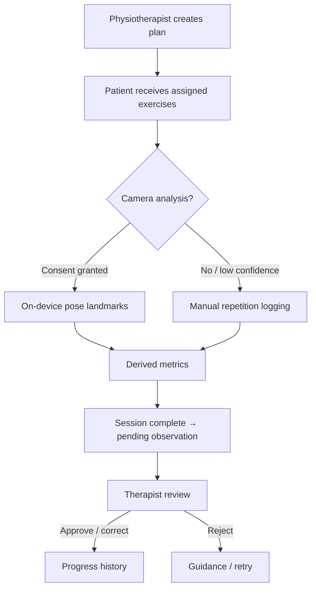
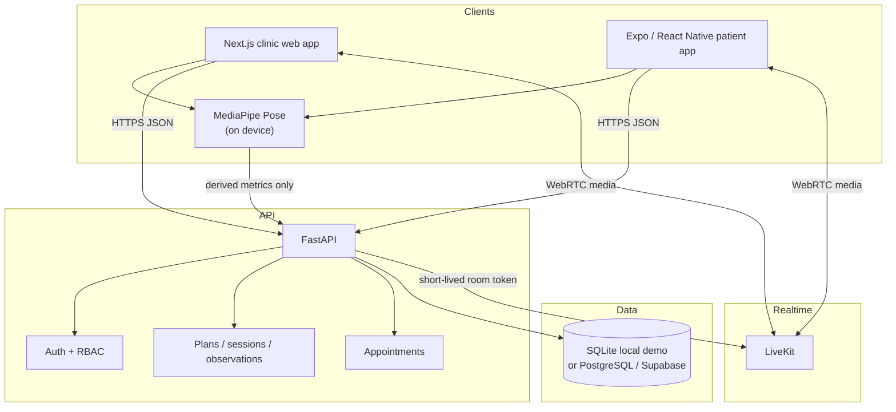
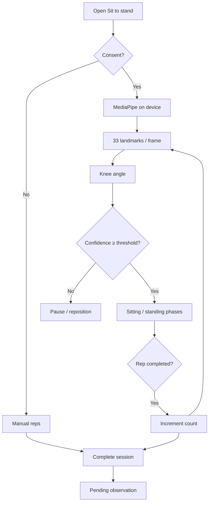

# Stride — Project Documentation

**An AI-assisted tele-physiotherapy platform for therapist-led rehabilitation.**

Stride is an educational software prototype. It is **not** a medical device. Movement analysis and derived metrics are decision-support signals; a physiotherapist remains responsible for clinical judgement. Pose output does not diagnose, prescribe treatment, or replace a licensed clinician.

---

## 1. Project overview

Stride connects patients and physiotherapists through one care workflow:

- rehabilitation planning and exercise prescription  
- home exercise sessions with optional on-device camera analysis  
- therapist review of movement observations  
- progress tracking from approved metrics  
- appointment scheduling and video consultation  

The product is deliberately narrower than “AI physiotherapy.” The goal is a usable tele-rehabilitation workflow in which AI reduces observation and documentation effort without claiming clinical autonomy.

### Problem

Remote physiotherapy is often delivered with generic video calls and disconnected records. Therapists must manually observe movement, count repetitions, and document progress across separate tools. Home-exercise adherence is hard to verify, and session context is fragmented.

### Solution

A therapist-led platform that unifies consultation, prescribed home exercises, consent-based camera movement analysis, reviewable observations, and progress history—while keeping the clinician in control of what enters the clinical record.

---

## 2. Goals and scope

### In scope (MVP)

| Area | Capability |
|---|---|
| Identity | Role-based accounts for patient, physiotherapist, and administrator |
| Binding | Patient–therapist association (invite code / caseload) |
| Plans | Therapist-created rehabilitation plans with exercise targets |
| Sessions | Patient home exercise sessions with recorded repetitions and notes |
| Movement analysis | Consent-gated, on-device pose analysis for selected exercises |
| Review | Therapist approve / correct / reject of observations |
| Progress | Patient and therapist views of confirmed metrics |
| Appointments | Schedule, list, complete, or cancel visits |
| Video | Appointment-scoped consultation rooms |
| Consent | Purpose-scoped camera-analysis consent |

### Out of scope

- Diagnosis, injury prediction, or autonomous treatment recommendations  
- Replacing a licensed physiotherapist  
- Support for every condition or exercise  
- Billing, insurance, EHR, or wearable integration  
- Default recording of consultation video  
- Emergency care or production medical-device certification  
- Custom model training on patient video  

---

## 3. Product principles

1. **Assist, do not diagnose.** AI output is a measurement aid.  
2. **Therapist in the loop.** Clinically meaningful progress requires therapist review.  
3. **Minimum necessary data.** Process pose locally where practical; store derived metrics rather than raw video by default.  
4. **Explain the signal.** Show which metric, confidence, or cue produced feedback.  
5. **Fail safely.** Low confidence, poor framing, pain, or unexpected movement pauses analysis and prompts safer action.

---

## 4. Evidence and literature basis

| Source | Relevance to Stride |
|---|---|
| [WHO — musculoskeletal conditions](https://www.who.int/news-room/fact-sheets/detail/musculoskeletal-conditions) | Large global rehabilitation need (~1.71 billion people with MSK conditions). |
| [Wicks et al., 2023](https://pmc.ncbi.nlm.nih.gov/articles/PMC10657214/) | Physiotherapist-led telerehabilitation can be effective; evidence certainty varies. |
| [Lam et al., 2023](https://pmc.ncbi.nlm.nih.gov/articles/PMC10155325/) | Markerless motion capture is promising for rehab measurement; needs task-specific validation. |
| [Hellsten et al., 2021](https://pmc.ncbi.nlm.nih.gov/articles/PMC8492027/) | Computer-vision rehab potential; real-world accuracy testing is essential. |

**Conclusion:** Literature supports a **bounded, therapist-led prototype**. It does not support treating consumer-camera pose estimates as diagnosis or as a replacement for clinical assessment.

---

## 5. User roles

| Role | Responsibility |
|---|---|
| **Patient** | Complete onboarding, follow assigned plans, perform guided sessions, grant/revoke camera consent, join consultations, view therapist-approved progress. |
| **Physiotherapist** | Manage caseload, create plans, schedule visits, join consultations, review movement observations, track progress. |
| **Administrator** | Approve pending physiotherapists, manage account status, oversee authorised users. |

---

## 6. Core rehabilitation workflow

Optional parallel path: scheduled appointment → join LiveKit consultation → therapist may mark visit completed.

---

## 7. System architecture

### Architecture decisions

- **On-device pose:** MediaPipe runs in the browser / native camera pipeline so exercise frames do not need to be uploaded.  
- **API owns authorization:** Protected changes cannot be self-approved by the client.  
- **Derived metrics only:** Observations store metric name, value, confidence, and review state—not raw video.  
- **Therapist review gate:** Patient-facing progress uses approved/corrected observations.  
- **Modular clients:** Web and mobile share the same FastAPI surface.

Diagram assets: [`docs/diagrams/`](diagrams/README.md) · raster exports also under [`docs/images/`](images/).

---

## 8. Technology stack

| Layer | Technology | Role |
|---|---|---|
| Web | Next.js, TypeScript, React | Patient, therapist, and admin portals |
| Mobile | Expo / React Native | Patient companion (plans, move, consult) |
| Backend | FastAPI, Python, SQLAlchemy, Pydantic | REST API, auth, clinical workflow |
| Database | SQLite (local demo) · PostgreSQL / Supabase (optional) | Relational clinic data |
| Auth | JWT (PyJWT), PBKDF2 password hashes, email OTP | Sessions and account lifecycle |
| Pose | MediaPipe Pose Landmarker (`@mediapipe/tasks-vision`; native MediaPipe on Android) | Landmarks and sit-to-stand counting (web) |
| Video | LiveKit (`livekit-api` server, `livekit-client` web) | Appointment-scoped consultations |
| Exercise content | Open Rehab Exercises (CC BY 4.0) | Seeded system exercise library |

---

## 9. Application architecture

### Web (`apps/web`)

- Auth: register, OTP verify, password reset, role-aware login routing  
- Patient: today/home, plan, move session, progress, appointments, consult, help  
- Therapist: caseload, reviews, plans, exercises, progress, appointments, consult  
- Admin: user list, pending therapist approval  
- Shared: API client, care helpers, PoseCamera, LiveKit ConsultationRoom  

### Mobile (`apps/mobile`)

- Patient-focused Expo app with auth, onboarding, home/plan/progress, move, appointments, consult  
- Pose skeleton overlay; automated sit-to-stand counter is strongest on web  
- Therapist mobile screens may exist; clinic therapist workflows are primarily web  

### Backend (`apps/api`)

Module catalogue (care-domain interfaces):

| Module | Purpose | Primary surface |
|---|---|---|
| Identity & access | Authenticate users; expose role and account status | `/auth/*` |
| Patient records | Caseload patient profiles | `/patients` |
| Exercise library | Reusable exercises + safety notes | `/exercises` |
| Rehabilitation plans | Prescribe plan items with targets / schedule fields | `/plans` |
| Appointments | Schedule and update visits | `/appointments` |
| Exercise sessions | Start/complete home performances | `/sessions` |
| Observations & review | Store metrics; therapist review decisions | `/observations` |
| Consent | Purpose-scoped camera consent | `/consent` |
| Administration | Account status; approve physiotherapists | `/admin/users` |
| Video consultation | LiveKit join/context/end for an appointment | `/video/consultations/*` |

Interactive OpenAPI: `http://127.0.0.1:8000/docs`  
Endpoint summary: [`docs/API.md`](API.md)

---

## 10. Authentication and authorization

### Account lifecycle

1. **Register** (email/password) → `pending_email`  
2. **Verify OTP** → `pending_onboarding`  
3. **Patient onboarding** (invite code, profile) → `active`  
4. **Therapist onboarding** (license/clinic) → `pending_approval`  
5. **Admin approve** → `active` + invite code issued  

Password reset uses hashed tokens; local demo may surface a reset token when SMTP is not configured. Google sign-in is stubbed as **not implemented** (HTTP 501).

### Authorization model

- JWT bearer tokens on protected routes  
- Server-side role checks (`patient`, `physiotherapist`, `administrator`)  
- Ownership scoping (patients see own plans/appointments; therapists see caseload)  
- Inactive accounts cannot obtain usable sessions  

---

## 11. Exercise library and rehabilitation plans

- System exercises are seeded from the **Open Rehab Exercises** catalog (CC BY 4.0) with attribution under `apps/api/data/open_rehab/`.  
- Therapists can also create custom library entries.  
- Plans attach exercises with targets (sets/reps) and optional week/day/session-type scheduling.  
- Patients execute plan items as sessions; they do not edit the library.

---

## 12. Exercise sessions and movement analysis

### Session path

1. Patient opens an assigned exercise.  
2. Optional camera analysis requires `camera_analysis` consent.  
3. Patient completes the session with reported repetitions (pose-assisted or manual).  
4. API stores `exercise_sessions` and `movement_observations` with `review_status = pending`.  

### Sit-to-stand pose pipeline (web)

| Attribute | Detail |
|---|---|
| Model | MediaPipe Pose Landmarker (Tasks Vision), lite variant |
| Runtime | Browser WASM (GPU when available); native MediaPipe path on Android |
| Output | Landmarks + visibility; Stride derives reps/confidence |
| Training | Pre-trained Google model only — no Stride fine-tuning on patient data |
| Privacy | Raw frames stay on device; API receives JSON metrics |

Implementation references:

- `apps/web/src/components/PoseCamera.tsx`  
- `apps/web/src/lib/pose/sitToStand.ts`  
- `apps/web/src/app/patient/move/[id]/page.tsx`  
- Automated test: `npm run test:pose` in `apps/web`  

---

## 13. Therapist observation review and progress

| Review status | Meaning |
|---|---|
| `pending` | Awaiting therapist decision |
| `approved` | Accepted into progress |
| `corrected` | Value adjusted; original may be retained |
| `rejected` | Not published as trusted progress (comment required) |

Patients see confirmed (approved/corrected) observations. Therapists work a pending queue from the clinic portal. Progress views derive from stored sessions and reviewed metrics—not hardcoded UI numbers.

---

## 14. Appointments and video consultation

### Appointments

- Therapist schedules visits for active linked patients.  
- List/get are ownership-scoped.  
- Status updates: `scheduled` → `completed` or `cancelled`.  
- Patient home surfaces the next relevant visit; therapist desk shows today/upcoming.

### Video

- Consultation is bound to an appointment.  
- Server mints short-lived LiveKit tokens for authorised participants.  
- Therapist ending a consultation can mark the appointment completed.  
- Stride does not store call media by default.

---

## 15. Database design

Primary implementation: SQLAlchemy models in `apps/api/app/models.py`.  
Local demo: SQLite file `apps/api/stride.db` (created on startup).  
Optional: PostgreSQL via `STRIDE_DATABASE_URL` (Supabase-compatible). Additive SQLite column helpers live in `schema_migrate.py` for academic prototype evolution (not full Alembic).

### Core entities

| Table | Purpose |
|---|---|
| `users` | Accounts, roles, status, therapist binding, clinic profile fields |
| `email_otps` / `password_reset_tokens` | Auth lifecycle tokens (hashed) |
| `exercises` | Library definitions (+ Open Rehab metadata / pose recipe keys) |
| `rehabilitation_plans` / `plan_exercises` | Prescriptions and targets |
| `exercise_sessions` | Home performances |
| `movement_observations` | Derived metrics + review state |
| `appointments` | Scheduled visits (optional plan link) |
| `consent_records` | Purpose-scoped consent |

### Conventions

- UUID string primary keys  
- Foreign keys on relationships  
- Enumerated roles/statuses  
- 3NF separation of user, library, plan, session, observation, consent  
- **Not stored:** raw camera video, LiveKit media, call recordings  

ER / architecture figures: [`docs/diagrams/`](diagrams/) and [`docs/images/`](images/).

---

## 16. Security and privacy

| Control | Implementation intent |
|---|---|
| Consent | Explicit `camera_analysis` consent before pose camera use |
| Data minimisation | Derived metrics only; no default video retention |
| AuthN/AuthZ | JWT + server-side RBAC and ownership checks |
| Secrets | Env-based configuration; `.env` gitignored |
| Passwords | PBKDF2 hashes; strength rules on register/reset |
| Video rooms | Appointment-scoped, short-lived tokens |
| Legal posture | Engineering prototype; not a claim of DPDP/HIPAA/medical-device compliance |

Health and movement records are personal data. Any real-patient use requires institutional ethics review and applicable legal assessment beyond this prototype.

---

## 17. UI and accessibility direction

Early wireframes: [`docs/wireframes/stride-ui-wireframes.png`](wireframes/stride-ui-wireframes.png).

Design principles carried into the product UI:

- Large readable type and strong contrast for older patients  
- One primary job per patient screen  
- Labelled controls; visible loading/error/empty states  
- Safety (“stop if pain”) copy that is not colour-only  
- Clear separation of AI-assisted metrics vs therapist-approved progress  

Screenshots: [`docs/screenshots/`](screenshots/).

---

## 18. Current implementation status

| Area | Status |
|---|---|
| Auth (register, OTP, login, reset) | Implemented |
| Patient / therapist onboarding | Implemented (web; mobile patient-focused) |
| Admin therapist approval + invite codes | Implemented |
| Exercise library + Open Rehab seed | Implemented |
| Plans / sessions / observations / review | Implemented |
| Progress views | Implemented (derived from API data) |
| Appointments lifecycle | Implemented |
| LiveKit video consultation | Implemented (requires LiveKit env configuration) |
| Sit-to-stand pose (web) | Implemented |
| Mobile pose overlay | Implemented (manual logging still primary for many exercises) |
| Google OAuth | Stub only (501) |
| Production Postgres hosting / app-store release | Not claimed |
| Full clinical validation report | Not claimed |

---

## 19. Known limitations

- Pose automation is intentionally limited (sit-to-stand is the primary automated counter on web).  
- Camera quality, framing, clothing, lighting, and occlusion affect landmark quality.  
- Local demo defaults to SQLite; Postgres/Supabase is optional configuration.  
- Email delivery for OTP/reset depends on SMTP; otherwise local/dev logging is used.  
- Video quality depends on network and LiveKit deployment.  
- Not clinically validated; not a medical device.  

---

## 20. Future roadmap

Meaningful directions already implied by the project:

1. Broader validated exercise set with physiotherapist-defined counting rules  
2. Stronger automated test coverage (auth, authorization, pose metrics, consult)  
3. Hardened production deployment (Postgres, secrets, HTTPS, monitoring)  
4. Deeper accessibility and device testing  
5. Formal evaluation protocol for repetition/angle accuracy vs human review  

---

## 21. Development and demo

### Demo accounts (development only)

Password: `StrideClinic1!` (override with `STRIDE_DEMO_PASSWORD`; do not commit real secrets)

| Role | Email |
|---|---|
| Administrator | `admin@stride.clinic` |
| Physiotherapist (invite `THERAP01`) | `therapist@stride.clinic` |
| Patient | `riyaz@stride.clinic` |

### Local commands

See the root [`README.md`](../README.md) for prerequisites, environment variables, and run instructions for API, web, and mobile.

### Related docs

| Document | Description |
|---|---|
| [`README.md`](../README.md) | Project entry point |
| [`API.md`](API.md) | Endpoint summary |
| [`diagrams/`](diagrams/) | Architecture / UML / ER figures |
| [`screenshots/`](screenshots/) | Product screenshots |
| [`presentation/`](presentation/) | Interactive slide deck source |

---

## 22. References

1. World Health Organization. [Musculoskeletal health](https://www.who.int/news-room/fact-sheets/detail/musculoskeletal-conditions).  
2. Wicks, Dennett, and Peiris. [Physiotherapist-led telerehabilitation for older adults](https://pmc.ncbi.nlm.nih.gov/articles/PMC10657214/).  
3. Lam, Tang, and Fong. [Markerless motion capture in rehabilitation](https://pmc.ncbi.nlm.nih.gov/articles/PMC10155325/).  
4. Hellsten et al. [Computer vision–based marker-less motion analysis](https://pmc.ncbi.nlm.nih.gov/articles/PMC8492027/).  
5. Google AI. [MediaPipe Pose Landmarker](https://ai.google.dev/edge/api/mediapipe/python/mp/tasks/vision/PoseLandmarker).  
6. LiveKit. [Documentation](https://docs.livekit.io/).  
7. Government of India. [Digital Personal Data Protection Act, 2023](https://www.indiacode.nic.in/handle/123456789/22037).  

---

**Safety notice:** Stride is an educational software project. It does not provide a diagnosis and must not be used as a substitute for assessment or treatment by a qualified healthcare professional.
