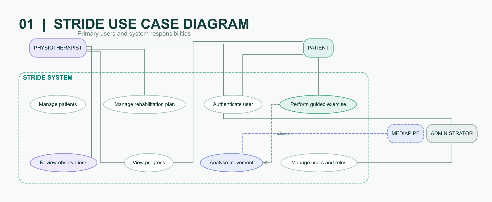
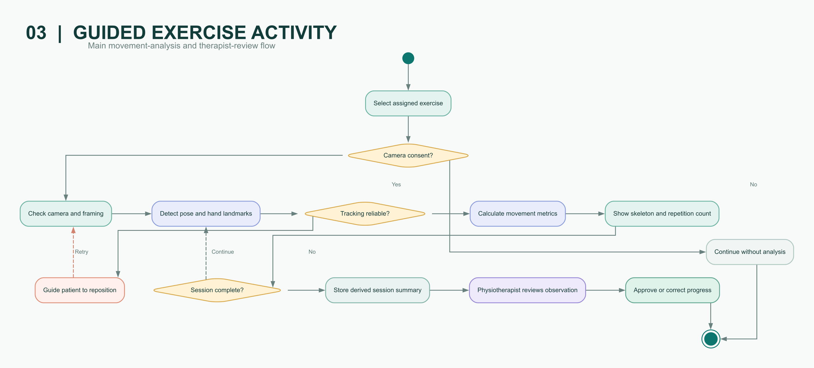
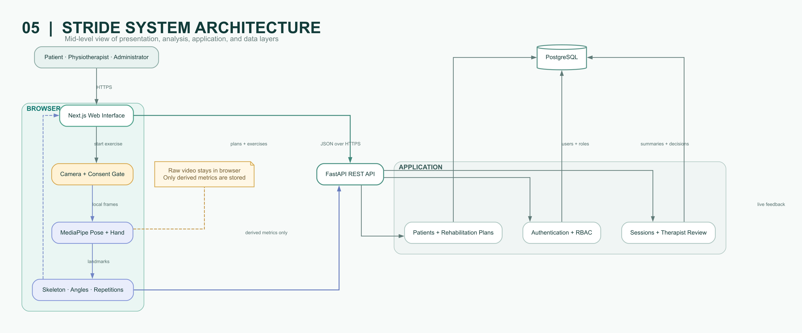
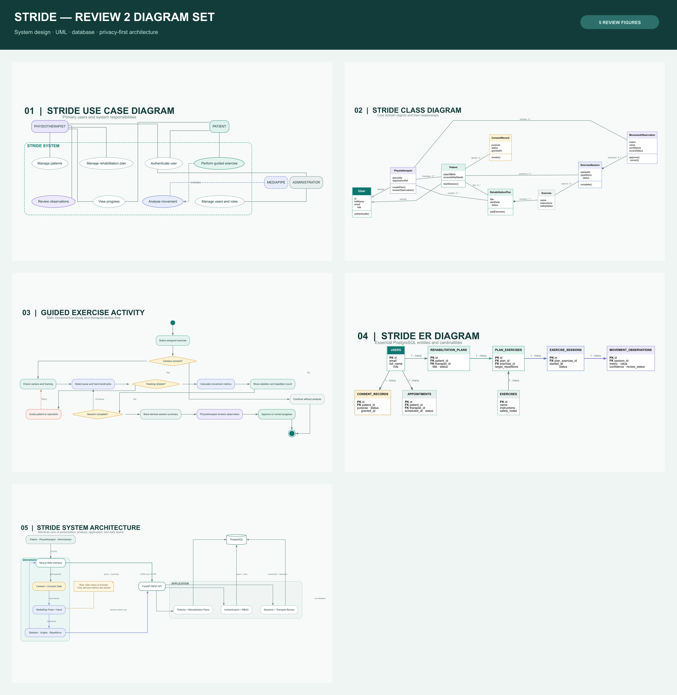

# Stride diagram set

Figures for the bounded MVP: therapist-assigned, camera-guided rehabilitation with on-device movement analysis and therapist review. Raw camera frames are not sent to the application API or stored by default.

## Figure 1 — Use case model

Patient, physiotherapist, administrator, and MediaPipe as the on-device movement-analysis engine.

## Figure 2 — Domain class model

Primary software objects, composition, and lifecycle relationships (application behaviour, not physical SQL alone).

## Figure 3 — Guided exercise activity

Consent, framing, confidence gating, local landmark processing, derived summary storage, and therapist approval.

## Figure 4 — Database ER model

Entities, keys, and cardinalities separating library exercises, plan items, sessions, and observations.

## Figure 5 — System architecture

Browser / API / data layers. MediaPipe executes on device; only derived metrics cross the privacy boundary.

## Overview collage

## Formats

- PNG — reports, GitHub, slides  
- SVG — vector originals  
- Graphviz DOT under [`source/`](source/) — maintainable definitions  
- Draw.io / Mermaid sources alongside PNG/SVG where present  

Raster copies used in early decks also live under [`../images/`](../images/).

> Stride is an educational prototype, not a diagnostic system or medical device. Movement observations require physiotherapist review before becoming approved progress.
