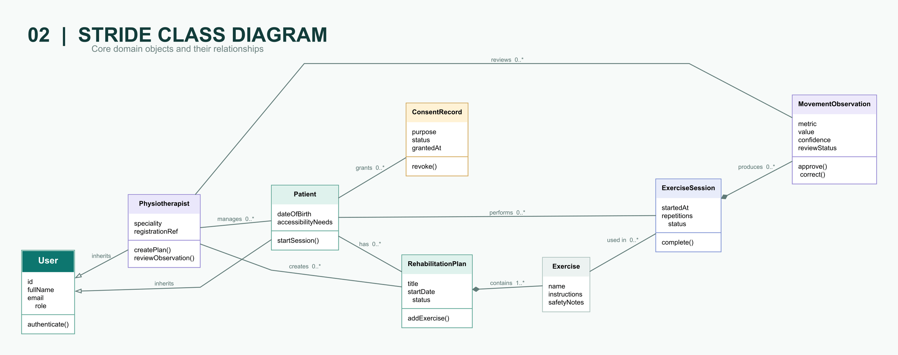
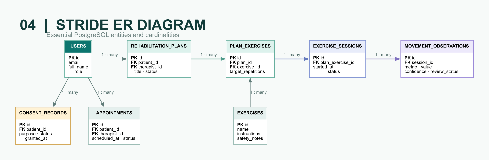

# STRIDE Review 2 — Diagram Set

These figures describe the same bounded MVP: therapist-assigned, camera-guided rehabilitation with on-device movement analysis and therapist review. Raw camera frames are not sent to the application API or stored by default.

## Figure 1 — Use Case Model

Shows the responsibilities of the patient, physiotherapist, administrator, and the external MediaPipe landmark engine. Dashed relationships identify required and optional behaviour.

## Figure 2 — Domain Class Model

Shows the primary software objects, inheritance, composition, responsibilities, and lifecycle relationships. It describes application behaviour rather than physical database tables.

## Figure 3 — Guided Exercise Activity

Shows the complete camera-guided exercise path, including consent, permission failure, camera framing, confidence gating, safety stops, local landmark processing, derived summary storage, and therapist approval.

## Figure 4 — Database ER Model

Shows the proposed PostgreSQL entities, representative columns, primary and foreign keys, and cardinalities. The model separates reusable exercises, prescribed plan exercises, performed sessions, and reviewed observations.

## Figure 5 — System Architecture

Shows the browser, API, and data layers. MediaPipe Pose and Hand Landmarker execute inside the browser; only derived metrics and session summaries cross the privacy boundary.

## Presentation overview

## Available formats

- High-resolution PNG files are intended for reports, GitHub, and presentation slides.
- SVG files are vector originals for lossless scaling and later editing.
- Graphviz DOT files under [`source/`](source/) are the maintainable diagram definitions.

> **Scope boundary:** STRIDE is an academic prototype and not a diagnostic system or medical device. Movement observations require physiotherapist review before becoming approved progress information.
